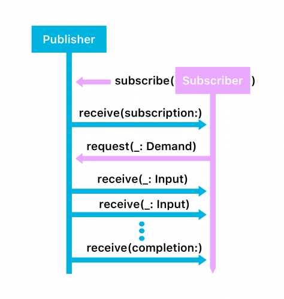

# Combine

Combine is the concept of integrated publisher and subscriber model.

Sample code to demonstrate existing NotificationCenter's observer model and it's new combinify model:

```swift
example(of: "Existing async method - observer") {

    let myNotification = Notification.Name("MyNotification")
    let mySecondNotification = Notification.Name("MyNotificationTwo")

    let center = NotificationCenter.default
    let observer = center.addObserver(forName: myNotification, object: nil, queue: nil) { (notification) in
        print("Notification received!")
    }
    center.post(name: myNotification, object: nil)
    center.post(name: mySecondNotification, object: nil)
    center.removeObserver(observer)
    center.post(name: myNotification, object: nil)
}

example(of: "Subscriber") {
    let myNoti = Notification.Name("MyNoti")
    let notiCenter = NotificationCenter.default

    let publisher = notiCenter.publisher(for: myNoti, object: nil)
    let subscriber = publisher.sink { (obj) in
        print("Notification received from publisher. Received value: \(obj.object!)")
    }
    notiCenter.post(name: myNoti, object: "100")
    subscriber.cancel()
    notiCenter.post(name: myNoti, object: "5400")
}
```


