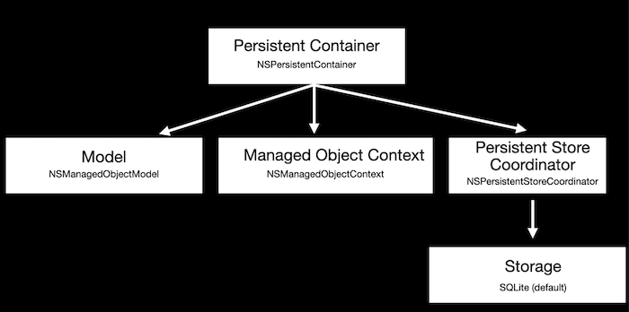

# Core Data

Core Data is a persistance framework, which can persist an object graph to a storage medium.

- It provides four store tips :
    1. SQLite
    2. Binary
    3. XML
    4. In-memory
- Core data is not an object relational mapper

Sample: 




### NSPersistentContainer

- From ios10

### Persistent container (NSPersistentContainer)

- Model (NSManagedObjectModel)
    - This is our model
    - Model is conforming to NSManagedObject protocol
- Managed Object Context (NSManagedObjectContext)
    - Create, load and manipulate managed objects
    - A single application can have multiple managed object contexts
    - Responsible for exucuting queries on the store
    - Keeping track of changes for what you are doing with the model
- Persistent Store Coordinator (NSPersistentStoreCoordinator)
    - Requires managed object context to initialize
    - Allows to setup underlying storage (SQLite is default)
    - Responsible for executing the queries on the store
    - Job: Take the nested graph that you have created and write it to some sort of a storage
        - Storage (SQLite)
        
    
    ```swift
    // To print the path of the documents directory
    let dirPaths = NSSearchPathForDirectoriesInDomains(.documentDirectory, .userDomainMask, true)
    print(dirPaths[0])
    ```
    

### Storage:

- XML (not avail in iOS)
- Binary
- Sqlite
- In-memory
- To create own store use **MSAtomicStore** & **NSIncrementalStore**

### Transformers:

ValueTransformers for UIColor

To see underlying sql queries executed on SQLite.. Set this below configuration

- Click App project > Edit Scheme
- Under 'Run' tab, add below argument under 'Argument passed on launch'
    - com.apple.CoreData.SQLDebug 1

### MVVM Pattern


### Why MVVM

Model should nt be binding to the view since it might have many business logics which will get exposed to the view. 


### MVVM & Web APIs


