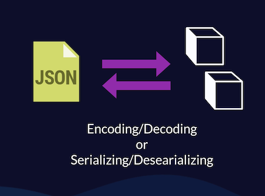

# Core Data - Part 2

Lessons learned from CWC course

Encoding Decoding between json and objects:




In order to store the data then the objects have to subclass the NSManagedObject class


## Core Data Steps:

1. You define your entities and attributes in the Core Data model
2. You generate your classes from the Core Data model
3. You get a reference to the Core Data persistent container
4. From the persistent container, you get a managed object context
5. Through that managed object context, you can create objects and store them in Core data for retrieval for later user.

### Defining entities/attributes

We have standard types like string, date, boolean, integer, double, float, and decimal etc. But we can also define our own types with tranferrable values. we can apply some attribute with 'transferrable' type and put the 'custom class' property with our own types.. for example: you can put '[String]'.. so the values will be considered as array of strings.

### Generate your model classes

If you had assigned the 'codegen' property of the core data modal with 'Manual/none' value instead of 'Class Difinition' then you will have to come up with your own classes.

You can follow the below steps to generate the classes:

- Select the coredata model
- Goto Editor menu and click on 'Create NSManagedObject Subclass'

This will create the necessary classes for you. there will be two class files.. one for the core data class and another one for the class properties.

#### Codegen

There is one another option for the codegen property of the core data model. Its called 'Category/Extension' and it will generate the extension classes alone for you.

### PersistenceContainer - Define with Singleton pattern

```Swift
struct PersistenceController {
    static let shared = PersistenceController()

    let container: PersistenceContainer
    private init() {
        container = NSPersistenceContainer(name: "Core_data_model")
        container.loadPersistentStores(...) { ... }
        ..
        ..
    }
}
```

### Accessing ManagedObject Context

```Swift
let a = PersistenceController.shared.container.viewContext
```

#### Adding the ManagedObjectContext to the environment

```Swift
@main
struct Core_Date_Demo: App {
    let persistenceController = PersistenceController.shared

    var body: some Scene {
        WindowGroup {
            ContentView()
                .environment(\.managedObjectContext, persistenceController.container.viewContext)
        }
    }
}

//accessing the managedobjectcontext in other views via environment
struct ContentView: View {
    @Environment(\.managedObjectContext) private var viewContext

    ...
    ...
}
```
