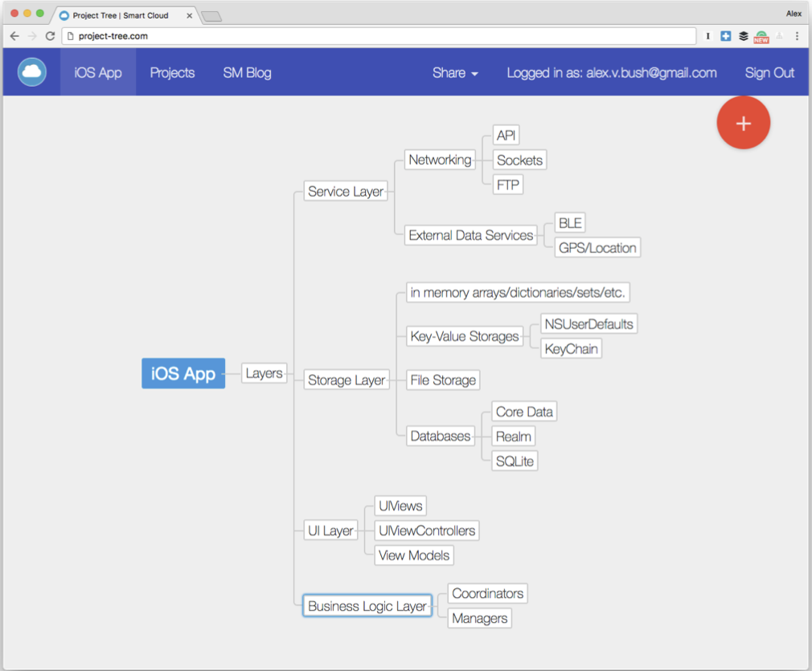

# The iOS Interview Guide

## The Big picture

If you build enough apps you’ll start noticing patterns. You’ll see that there are things you do over and over again in one form or another that are essentially the same. When that happens, you realize how all apps are similar to each other. Sure they might differ in looks and what they do for the user, but overall, the way you build them is the same. Therefore when developers are interviewed for any iOS position, they will be asked a similar set of questions revolving around broad iOS topics. The main idea is that interviewers need to figure out what you know about building iOS apps.

In this chapter, we’ll look at what iOS apps are, where they fit in the iOS system, the big picture design patterns that emerge out of building iOS apps, and how you can group and structure interview questions around those topics to systematize your own learning.

### **What is an iOS application and where does your code fit into it?**

If you think about it long enough, your typical iOS application is just a giant glorified run loop. It waits for user input and gets interrupted by external signals such as phone calls, push notifications, home button press, and other app life cycle events.

Following is Apple’s diagram of the iOS app life cycle:


**UIApplication** is just an object built around the **main()** loop to augment it and give us more usability that calls convenient callbacks to your **UIAppDelegate** subclass. Those “convenient” callback methods would be:

- **application:willFinishLaunchingWithOptions:**
- **application:didFinishLaunchingWithOptions:**
- **applicationDidBecomeActive:**
- **applicationDidEnterBackground:**
- **applicationWillResignActive:**
- **applicationWillEnterForeground:**

What you actually do as an iOS app developer is just plug into those callbacks to run your application’s code and business logic. As soon as you understand that, you will realize where the line is drawn between your app and **Cocoa Touch** code. It is an important distinction to make.

A brand new project’s **AppDelegate** would look like this:

```swift
import UIKit //@UIApplicationMain
class AppDelegate: UIResponder, UIApplicationDelegate {
    var window: UIWindow?
    func application(application: UIApplication,
                     didFinishLaunchingWithOptions launchOptions:
        [NSObject: AnyObject]?) -> Bool
    {
        let storyboard = UIStoryboard(name: "Main", bundle: nil)
        let rootViewController = storyboard.instantiateInitialViewController()
        self.window = UIWindow(frame: UIScreen.main.bounds)
        self.window?.rootViewController = rootViewController
        self.window?.makeKeyAndVisible()
				return true
		}
    func applicationWillResignActive(application: UIApplication) {
        print("applicationWillResignActive")
		}
    func applicationDidEnterBackground(application: UIApplication) {
        print("applicationDidEnterBackground")
		}
    func applicationWillEnterForeground(application: UIApplication) {
        print("applicationWillEnterForeground")
		}
    func applicationDidBecomeActive(application: UIApplication) {
        print("applicationDidBecomeActive")
		}
    func applicationWillTerminate(application: UIApplication) {
        print("applicationWillTerminate")
		}
}
```

It is very typical to have something like that where you’d either use a storyboard or create an initial view controller in code. But at the end of the day, what happens is that you create a **UIWindow** to be the main window of the UI of your application and then you create the first view controller that is going to be displayed to the user.

To the iOS system, your app is yet another building block, yet another run/main loop that can be launched on user demand or when some other event in the system like push notification or location change happens.

## Patterns and Layers

After you build a few iOS applications of various complexities, one thing you might start to notice is that there are distinct layers of responsibility in each app’s codebase. Regardless of the application the common things would be: HTTP networking, storing data to disk, location GPS work, JSON parsing, data serialization, UI composition, resources and objects coordination, and other tasks.

All of those things in your code can by grouped into the following layers of responsibility: **storage layer**,**service layer**,**business logic layer**, and **UI layer**.

### Storage Layer

The main responsibility of this layer is to store data for your application and play the role of the **“ultimate source of truth”** for the rest of your code. Examples of what goes into this layer could be the following: **Core Data**, **Realm**, **NSUserDefaults**, **KeyChain**, **Disk File storage**, and
**in-memory arrays and dictionaries/sets**.

### Service Layer

This layer is responsible for all things involving networking and external com- munication. That could be, an HTTP client and a set of accompanying objects that do networking for the app and connect with the backend JSON API. Or it could be a Bluetooth Low Energy (BLE) client wrapper code that helps your app communicate and send or receive data from external Bluetooth devices. Or it could be a socket connection code. Or it could be a location service that connects with a device’s GPS delegates and gets location change updates.

The bottom line is that it’s the code that knows how to work with external interfaces, whether it’s HTTP or BLE or something else. Also quite often data serialization and mapping (let’s say from JSON to your custom objects) are included in this layer as well.

### UI Layer

The UI layer is responsible for drawing things on the screen. This is all the stuff that naturally goes into that bucket like UIView subclasses, Autolayout, Table Views, Buttons, Collection Views, and Bar Buttons.

Two other things that also belong to this layer that might not be obvious are View Controllers and View Models. View Controllers are suppose to do justthat,controltheview.View Modelsarecomplimentaryobjectsthathelp with decluttering and decoupling views from other layers of responsibility. Re- member the key to a happy and healthy iOS codebase is a skinny controller.

### Business Logic Layer

In this layer are objects that are responsible for the actual application’s business logic, objects that use components of other layers to achieve results and do the work for the user.

An example of what goes into this layer could be a manager object that takes care of token encryption and saving to keychain using keychain storage and some kind of encryption service in it.

The main idea is that this layer helps us keep services, storages, and other layers decoupled from each other and tell them (aka orchestrate and coordinate) what to do to achieve results. This layer is what actually makes your application useful.

Overview:



# The Interview Game

There are three things you need to do before you go on an interview:

- Job Search
- Marketing
- Preparation

## Job Search

There are several ways you can do this and they are not mutually exclusive.

### Job Boards and Company Websites:

The most straightforward approach to the job search is to put together a resume and portfolio and apply for positions posted on the internet. This includes online job boards and listings on Stack Overflow, LinkedIn and other profes- sional networking and recruitment websites. It is important, however, to have a good resume that makes you stand out.

Don’t blast the same resume and cover letter to every position and company you can find. To stand out you need to tweak them so that they specifically suit each job you are applying for.

### Referrals/Friends:

Having a friend or acquaintance refer you for a position is another good way to land a job. Ask everyone you know if they’ve heard of anyone who needs a developer with your skill set.

### Recruiters:

Recruiters do a great job of lifting the burden of searching for positions off your shoulders. After all, they are on your side. Sure, they get a nice payout when you land a job. It’s in their interests, though, to get you the best job they can because if you get a big salary, they can negotiate with your new employer for a bigger cut. Give them a good resume to use and make adjustments to it if they ask for them. Also, tell them what you are ideally looking for and your salary preference. Then sit back and relax and let them source new gigs for you.

Always remember, too, that if the recruiter you are working with is not produc- ing results, don’t be discouraged. Try a different one and keep searching for jobs on your own.

## Figure out what team/company size you want to work with

Team size matters. It should influence your expectations as a developer and will affect the way an interview is conducted.

### Small Company:

If they are a small startup/company (0-10 people in the engineering team) with “hackish” culture then they’ll most likely ask you about prototyping things and will expect you to “build shit quickly” disregarding quality and praising the speed. They won’t care much about good architecture and scalability or performance at early startup stage they care more about “time to market” which means quickly putting together something that works most of the time and shipping it.

The expectation on you as a developer (especially if you’ll be the sole iOS developer on the team) would be that you can deliver apps end to end - from the very first line of code down to the release submission to the app store with all the necessary provisioning profiles etc. You need to be able to figure things out quickly. Most likely you won’t be working with legacy codebases here.

### Large Company:

Interviewing at a large company (50+ people in the engineering team) you will probably be asked generic computer science questions and sometimes interviewers won’t even go into iOS-specifics.

Big organizations have typically already figured out what their product is and are scaling product and market- ing efforts. For you, this means that the interview is likely to revolve around hypothetical problem-solving and scalability.

Large organizations care about the performance impact of file downloads, network requests, and other compu- tations made on the client side. Unlike small organizations, there most likely will be time for doing optimizations.

Timelines in bigger organizations are longer and typically they are looking for people to fill specialized roles. You’ll often find that large organizations like Facebook or LinkedIn are looking for developers (and even entire teams) to focus on things like UI performance, net- working download speeds or other deeper specializations in iOS software that smaller companies can’t spend time on. Also expect to be working with legacy codebases.

### Mid-size Company:

When applying to a mid-size company (10 - 50 people), you should expect a mix of what small companies need and big companies expect. Mid-size com- panies are not big enough to spare resources on people who specialize in things like performance but aren’t small anymore to move super fast and risk breaking things. They’ll expect you to be a well-rounded and balanced developer.

As with a small company, in most cases you will be expected to build and ship things end-to-end but you will also have to keep an eye on performance, scal- ability, and architecture for future maintainability. If you interview at a good mid-size company, the questions are likely to encompass all of these areas as well as cover broad iOS, architecture and CS knowledge. They need someone whose talents go beyond shaving microseconds off networking performance or scrolling in table views.

> The main message here is that you should figure out what type of company and team you’d like to join ahead of time and prepare for your interview accord- ingly. Regardless of your choice, though, the advice in the following chapters about interview questions on UI, Networking, Storage, and other technical iOS topics will help you prepare for interviews at any company regardless of its size.

## Marketing

This is something that most developers neglect. When you’re aiming at your dream job, you need to stand out from the crowd if you want to get a foot in the door. The way to do this is through marketing yourself with your resume, your blog, your GitHub profile, and other links and resources that showcase you as a great developer and an appealing candidate.
