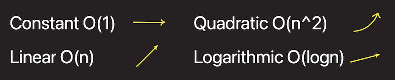

# DSA - Jonathan Course

## Big-O Notation

What? How? Runtimes Why?

- Big O is the language used to compare performance of algorithms (time and space).
- It’s all about dominant operations
  - time (how fast)
  - space (how much memory)
- When measuring O(n), always think worst case.
- Can often trade-off time for space.

### Most common characteristics are:



For example: in the below code sample, as the count of the array increases the time also gets increased.

```swift
import Foundation

func findNemo(_ arr: [String]) {
    let before = Date()

    for i in 0..<arr.count {
        if arr[i] == "nemo" {
            print("Found him!")
        }
    }

    let after = Date()
    let component = Calendar.current.dateComponents([.nanosecond], from: before, to: after)
    let milliSeconds: Double = Double(component.nanosecond! / 1000000)
    print("Finding nemo took: \(milliSeconds))")
}

//let nemo = ["nemo"]
let nemo = Array<String>(repeating: "", count: 1000)
findNemo(nemo)

/*
Results:

[When count is 1]
	Finding nemo took: 1.0

[When count is 1000]
	Finding nemo took: 26.0

[When count is 10000]
	Finding nemo took: 67.0

[When count is 100000]
	Finding nemo took: 128.0

*/
```

Here the number of elements passed in and the number of searches is linear.

in BigO notation we call this linear time as `O(n) - linear`

### Constant time O(1)

```swift
func constantTime(_ n: Int) -> Int {
    let result = n * n
    return result
}
```

### Linear Time O(n)

```swift
func linearTime(_ A: [Int]) -> Int {
    for i in 0..<A.count {
        if A[i] == 0 {
            return 0
        }
//        print(i)
    }
    return 1
}
linearTime([1, 2, 3])
```

<aside>
💡 When it comes to BigO notation we are always looking at the worst case performance

</aside>

### Logarithmic Time O(log n)

```swift
func logarithmicTime(_ N: Int) -> Int {
    var n = N
    var result = 0
    while n > 1 {
        n /= 2
//        print(n)
        result += 1
    }
    return result
}
logarithmicTime(128)

// log n = 128 64 32 16 8 4 2 1
```

We can see this in a algorithm like **Binary Search Tree**

### Quadratic Time O(n^2)

```swift
func quadratic(_ n: Int) -> Int {
    var result = 0
    for i in 0..<n {
        for j in i..<n {
            result += 1
            print("\(i) \(j)")
        }
    }
    return result
}
quadratic(16)

// Got two for loops one embeded with other.
```

### **Useful Resource Link : [bigocheatsheet.com](http://bigocheatsheet.com)**


## Naive Brute Force Vs Performance Code:

In the first approach we used the embedded loop and the time complexity becomes O(n^2).. then we apply hash-map technic and reduce the time complexity by O(2n)..

However, here we are _trading off the space for time_.

|          | Time   | Space |
| -------- | ------ | ----- |
| Brute    | O(n^2) | O(1)  |
| Hash Map | O(n)   | O(n)  |

```swift
/* Given two arrays, create a function that let's a user know whether these two arrays contain any common items. */

// Naive brute force O(n^2)
func commonItemsBrute(_ A: [Int], _ B: [Int]) -> Bool {
    for i in 0..<A.count {
        for j in 0..<B.count {
            if A[i] == B[j] {
                return true
            }
        }
    }
    return false
}
commonItemsBrute([1, 2, 3], [4, 5, 6])
commonItemsBrute([1, 2, 3], [3, 5, 6])

// Convert to hash and lookup via other index
func commonItemsHash(_ A: [Int], _ B: [Int]) -> Bool {

    // Still looping...but not nested - O(2n) vs O(n^2)
    var hashA = [Int: Bool]()
    for a in A { // O(n)
        hashA[a] = true
    }

    // Now lookup in the hash to see if elements of B exist
    for b in B {
        if hashA[b] == true {
            return true
        }
    }
    return false
}
commonItemsHash([1, 2, 3], [4, 5, 6])
commonItemsHash([1, 2, 3], [3, 5, 6])
```

<aside>
💡 #1 Tip: Hash Maps / Dictionaries are your friend when it comes to improve the performance.

</aside>

## Tips for solving problems

- Start with Brute Force
- Use Paper
- Handle edge cases (ex: empty array, bogus data etc..)
- Optimize after

# Array

Topic: What arrays are? How they work? Why special?

3 Things to know

- Arrays can contain anything
  ```swift
  let ints = [Int]()
  let strings = [String]()
  let people = [Person]()
  ```
- Arrays are of a fixed size (in many languages, but not it Swift)
- Arrays support random access
  - Since arrays are indexed we can access any value thru indices.. Stacks, Queue cant do this. The constant time for Get method is `O(1)`
  ```swift
  get(4) --> data[4] --> "a"
  get(5) --> data[5] --> "b"
  ```

## Mechanics worth understanding

### Insert


### Delete


### Growing the Size of an Array


### Append

Normally append is faster as it does not require to shift the elements.. so the complexity is `O(1)` on average. But when an array needs to reallocate storage before appending then the complexity will be `O(n)`. Refer Apple documentation below.


## Whats different about arrays in Swift?

```swift
var array = ["a", "c", "d"]
array.insert("b", at: 1)
array.remove(at: 1)
```

All the heavy lifting is done for you.

- We dont need to specify an array size.. but its possible
  ```swift
  let arrayOfSpecificSize = Array<Int>(repeating: 1, count: 10)
  ```
- remove, insert, appead methods are being added by default. Normally these will be in a different data structure like ArrayList in a language like Java.

## For the Interview

- Fixed size
- Random access - O(1)
- Insert / Delete - O(n)
- Arrays can shrink and grow - O(n)
- Swift arrays handle heavy lifting for you

## Array - Interview Question 1

```swift
/*
 Rotate array to right N times.
 https://app.codility.com/programmers/lessons/2-arrays/cyclic_rotation/

 For example, given

     A = [3, 8, 9, 7, 6]
     K = 3
 the function should return [9, 7, 6, 3, 8]. Three rotations were made:

     [3, 8, 9, 7, 6] -> [6, 3, 8, 9, 7]
     [6, 3, 8, 9, 7] -> [7, 6, 3, 8, 9]
     [7, 6, 3, 8, 9] -> [9, 7, 6, 3, 8]

 */
```

### My Solution:

```swift
func solution(A: [Int], K: Int) -> [Int] {
    var B : [Int] = A
    var last: Int = 0

    for _ in 1...K {
        last = B.popLast()!
        B.insert(last, at: 0)
    }
    return B
}

solution(A: [1, 2, 3, 4, 5], K: 1) // 5 1 2 3 4
solution(A: [1, 2, 3, 4, 5], K: 2) // 4 5 1 2 3
solution(A: [1, 2, 3, 4, 5], K: 3) // 3 4 5 1 2

solution(A: [3, 8, 9, 7, 6], K: 3) // [9, 7, 6, 3, 8]
```

### Jonathan Solution

```swift
func solution(A: [Int], K: Int) -> [Int] {
    guard !A.isEmpty else { return [] }
    guard K > 0 else { return A }

    var result = A
    for _ in 1...K { // O(n)
        result = rotateRightOnce(A: result)
    }
    return result
}

func rotateRightOnce(A: [Int]) -> [Int] {
    var newArray = Array<Int>(repeating: 0, count: A.count)
    for i in 0..<A.count - 1 { // O(n)
        newArray[i + 1] = A[i]
    }
    newArray[0] = A.last!

    return newArray
}

rotateRightOnce(A: [0])
rotateRightOnce(A: [1, 2, 3])

solution(A: [], K: 0)
solution(A: [], K: 1)
solution(A: [-4], K: 0)
solution(A: [-4], K: 1)
solution(A: [1, 2, 3], K: 4)

solution(A: [1, 2, 3, 4, 5], K: 1)
solution(A: [1, 2, 3, 4, 5], K: 2)
solution(A: [1, 2, 3, 4, 5], K: 3)

solution(A: [3, 8, 9, 7, 6], K: 3) // [9, 7, 6, 3, 8]
```

## Array - Interview Question 2

```swift
/*
 We are given a string S representing a phone number, which we would like to reformat. String S consists of N characters: digits, spaces, and/or dashes. It contains at least two digits.

 Spaces and dashes in string S can be ignored. We want to reformat the given phone number is such a way that the digits are grouped in blocks of length three, separated by single dashes. If necessary, the final block or the last two blocks can be of length two.

 For example:

 S = "00-44   48 5555 8361" should become
     "004-448-555-583-61"

 Assume:
 - S consists only of digits (0-9), spaces, and/or dashses (-)
 - S containts at least two digits

 Translate:

 Would like to reformat a phone number string so that:
 - every third char is a "-"
 - spaces and dashes don't matter
 - if the block ends in anything other than -xxx or -xx reformat to a block of two like xx-xx (not obvious)

 */
```

### My Solution

```swift
func solution(_ S : String) -> String {
    var newS: String = ""
    var mS: String = S.replacingOccurrences(of: " ", with: "").replacingOccurrences(of: "-", with: "")
    var counter = 0

    for C in mS {
        counter += 1
        if counter > 3 {
            newS += "-"
            counter = 1
        }
        newS += String(C)
    }
    var aS = Array(newS)

    if aS[aS.count - 2] == "-" {
        aS[aS.count - 2] = aS[aS.count - 3]
        aS[aS.count - 3] = "-"
    }

    return String(aS)
}

solution("123456789")           // 123-456-789
solution("555372654")           // 555-372-654
solution("0 - 22 1985--324")    // 022-198-53-24

// Edge cases
solution("01")                          // 01
solution("012")                         // 012
solution("0123")                        // 01-23
solution("0123       444")              // 012-34-44
solution("------0123       444")        // 012-34-44
```

<aside>
💡 Jonathan’s solution is almost same as mine. 🥳

</aside>

## Array - Interview Question 3

```swift
/*
 When someone searches their contacts based on a phone number, it's nice when a list
 of contact pops up.

 Write an algorithm that searches you contacts for phone number strings, and returns:
  - NO CONTACT if contact can't be found
  - A contact if a contact is found
  - The first alphabetized contact if there are multiple

 A = ["pim", "pom"]             // Contacts (return one of these)
 B = ["999999999", "777888999"] // Phone numbers for each contact A[i] = B[i]
 P = "88999"                    // Search phrase

 Answer should be correct. Don't worry about performance.
 */
```

### My Solution

```swift
public func solution(_ A : [String], _ B : [String], _ P : String) -> String {
    var resultA = [String]()
    guard !P.isEmpty else {
        return "NO CONTACT"
    }

    for i in 0..<B.count {
				// Initially I used below line
			  // but it wont cover the case where
        // the search string appears in the middle.
        // if B[i].starts(with: P) || B[i].hasSuffix(P){

				if B[i].contains(P) { //Borrowed from Jonathan
            resultA.append(A[i])
        }
    }
    var sortedResult = resultA.sorted()

    if sortedResult.count == 0 {
        return "NO CONTACT"
    }
    else {
        return sortedResult[0]
    }
}

let A = ["pim", "pom"]
let B = ["999999999", "777888999"]
let P = "88999"

solution(A, B, P)   // pom
solution(["sander", "amy", "ann"], ["12345", "23456", "123"], "1")  // ann
solution(["ada,", "eva", "leo"], ["1212", "1111", "4444"], "112")   // NO CONTACT

//// edge cases
solution([String](), [String](), "")    // NO CONTACT
solution(A, B, "")      // NO CONTACT
```

<aside>
💡 Jonathan’s solution is mostly same as mine. 🥳

</aside>

# Linked List

Topics: What? Why special? How it works? How different?

### What problem it solves?

- When it comes to array its slow in inserting values at front. It takes the linear time O(n).
- Also Array takes more space.
  

### Linked list on the other hand:

- Fast at adding elements to the front
- able to dynamically size

### What is Linked list?


It can be considered as a goods train. First node in the list is called the Head where we add things. The last node is called Tail, and it always points to `nil`. Everything else is a linking car point to the next car.

**Example: Simple Linked list**


**Printing the data:**


### Linked-List Full Implementation (Swift Source code here)

```java
class Node {
    var data: Int
    var next: Node?

    init(_ data: Int, _ next: Node? = nil) {
        self.data = data
        self.next = next
    }
}

class LinkList {
    private var head: Node?

    func addFront(_ data: Int) {
        let newNode = Node(data)
        newNode.next = head
        head = newNode
    }

    func getFirst() -> Int? {
        if head == nil {
            return nil
        }
        return head!.data
    }

    func addBack(_ data: Int) {
        let newNode = Node(data)

        if head == nil {
            head = newNode
            return
        }

        var node = head!
        while(node.next != nil) {
            node = node.next!
        }
        node.next = newNode
    }

    func getLast() -> Int? {
        if head == nil {
            return nil
        }

        var node = head!
        while(node.next != nil) {
            node = node.next!
        }
        return node.data
    }

    func insert(position: Int, data: Int) {
        if position == 0 {
            addFront(data)
            return
        }

        let newNode = Node(data)
        var currentNode = head

        for _ in 0..<position - 1{
            currentNode = currentNode?.next!
        }
        newNode.next = currentNode?.next
        currentNode?.next = newNode
    }

    func deleteFirst() {
        head = head?.next
    }

    func delete(at position: Int) {
        if position == 0 {
            self.deleteFirst()
            return
        }

        var nextNode = head
        var previousNode: Node?
        for _ in 0..<position {
            previousNode = nextNode
            nextNode = nextNode?.next
        }
        previousNode?.next = nextNode?.next
    }

    func deleteLast() {
        if head?.next == nil {
            head = nil
            return
        }

        var nextNode = head
        var previousNode: Node?
        while(nextNode?.next != nil) {
            previousNode = nextNode
            nextNode = nextNode?.next
        }
        previousNode?.next = nil
    }

    func delete(data: Int) {
        if head == nil { return }
        if head!.data == data {
            head = head?.next
        }

        let current = head
        while current?.next != nil {
            if current?.next?.data == data {
                current?.next = current?.next?.next
                return
            }
        }
    }

    var isEmpty: Bool {
        return head == nil
    }

    func clear() {
        head = nil
    }

    func printLinkedList() {
        if head == nil {
            print("Empty")
            return
        }

        var result = [Int]()
        var node = head
        result.append(node!.data)

        while node?.next != nil {
            result.append(node!.next!.data)
            node = node?.next
        }

        print(result)
    }
}

/*
Sample Callings:

let linkedList = LinkList()
linkedList.addFront(3)
linkedList.addFront(2)
linkedList.addFront(1)
linkedList.printLinkedList()

linkedList.getFirst()

linkedList.addBack(4)
linkedList.printLinkedList()

linkedList.getLast()

linkedList.insert(position: 2, data: 5)
linkedList.printLinkedList()
*/
```

<aside>
💡 `addFront` takes **O(1)**
`addBack` takes **O(n)**

</aside>

### Double Linked-List


### Real world usage of Linked List

- In **DOOM** game, linked list is used for memory management
- Linked list is used in **UIKit Responder Chain**

### How different than an array?


### What we learned?

- Anything to do with the front is O(1)
  - addFront / deleteFirst / getFirst
- Anytime you need to walk O(n)
  - addBack / getBack / deleteLast
- No random access
- Always the right size

## Interview Question 1

```swift
/*
 Write a function that determines the length of any linked list.
 */

class Node {
    var data: Int
    var next: Node?

    init(_ data: Int, _ next: Node? = nil) {
        self.data = data
        self.next = next
    }
}

func length(_ head: Node?) -> Int {
    // Do your work here...
    if head == nil {
        return 0
    }

    var length = 1
    var current = head
    while current?.next != nil {
        current = current?.next
        length += 1
    }

    return length
}

// 1 2 3 4 5 6
let node6 = Node(6)
let node5 = Node(5, node6)
let node4 = Node(4, node5)
let node3 = Node(3, node4)
let node2 = Node(2, node3)
let node1 = Node(1, node2)

length(nil) // 0
length(node1) // 6
length(node3) // 4
length(node5) // 2
```

## Interview Question 2

### Finding the merge point

Its a great example in linked-list..

Real world example would be the subway train system.


### Question is:

> **Find Merge Point of Two Lists.**

Given pointers to the head nodes of 2 linked lists that merge together at some point, find the node where the two lists merge. The merge point is where both lists point to the same node, i.e. they reference the same memory location. It is guaranteed that the two head nodes will be different, and neither will be NULL. If the lists share a common node, return that node's data value.

Note: After the merge point, both lists will share the same node pointers.

**Data:**

> // 1 2 3 4 5 6
>
> **let** node6 = Node(6)
>
> **let** node5 = Node(5, node6)
>
> **let** node4 = Node(4, node5)
>
> **let** node3 = Node(3, node4)
>
> **let** node2 = Node(2, node3)
>
> **let** node1 = Node(1, node2)
>
> // 10 11 4 5 6
>
> **let** node11 = Node(11, node4)
>
> **let** node10 = Node(10, node11)

---

**Solution Approach 1: Brute Force → O(n^2)**


**Solution Approach 2: Trade off time for space (with Dictionaries) →** O(2m + 2n) **→** **O(m + n)**


**Solution Approach 3: Insight → O(n + m)**


### Question 2 - Answer here

```java
class Node {
    var data: Int
    var next: Node?

    init(_ data: Int, _ next: Node? = nil) {
        self.data = data
        self.next = next
    }
}

func length(_ head: Node?) -> Int {
    if head == nil {
        return 0
    }

    var len = 0
    var current = head
    while current != nil {
        len += 1
        current = current?.next
    }
    return len
}

func printLinkedList(_ head: Node?) {
    if head == nil { return }

    var result = [Int]()
    var node = head
    result.append(node!.data)

    while node?.next != nil {
        result.append(node!.next!.data)
        node = node?.next
    }

    print(result)
}

// Loop through every element of A while checking every element of B
func findMergeBrute(headA: Node?, headB: Node?) -> Int? { // O(m*n)
    let m = length(headA) // O(m)
    let n = length(headB) // O(n)

    var currentA = headA

    for _ in 0...m-1 { // O(m)
        var currentB = headB
        for _ in 0...n-1 { // O(n)
            let A = currentA?.data
            let B = currentB?.data
            print("A: \(A ?? 0) B: \(B ?? 0)")
            if A == B {
                return currentA?.data
            }
            currentB = currentB?.next
        }
        currentA = currentA?.next
    }
    return nil
}

// Trade-off time for space
func findMergeSpaceTime(headA: Node?, headB: Node?) -> Int? { // O(2m + 2n) > O(m + n)
    // Create a Dict of all nodes of B
    // Use it to loop up each element of A
    let m = length(headA) // O(m)
    let n = length(headB) // O(n)

    var dict = [Int?: Bool]()
    var currentB = headB
    for _ in 0...n-1 { // O(n)
        let B = currentB?.data
        dict[B] = true
        currentB = currentB?.next
    }

    var currentA = headA
    for _ in 0...m-1 { // O(m)
        let A = currentA?.data
        if dict[A] == true {
            return A
        }
        currentA = currentA?.next
    }
    return nil
}

// Insight: If we can line up the arrays, we can walk them once
func findMergeInsight(headA: Node?, headB: Node?) -> Int? { // O(n + m)
    // Figure out which is longer
    // Swap if necessary

    // Calculate d
    // Walk d for longer
    // Walk remainder for both
    let m = length(headA) // O(m)
    let n = length(headB) // O(n)

    var currentA = headA
    var currentB = headB

    if n > m {
        let temp = currentA
        currentA = currentB
        currentB = temp
    }

    let d = abs(m - n)

    for _ in 1...d { // O(n)
        currentA = currentA?.next
    }

    for _ in 0...n-1 { // O(n)
        print(4)
        let A = currentA?.data
        let B = currentB?.data
        if A == B {
            return A
        }
        currentA = currentA?.next
        currentB = currentB?.next
    }
    return nil
}

// 1 2 3 4 5 6
let node6 = Node(6)
let node5 = Node(5, node6)
let node4 = Node(4, node5)
let node3 = Node(3, node4)
let node2 = Node(2, node3)
let node1 = Node(1, node2)

// 10 11 12 13 4 5 6
let node11 = Node(11, node4)
let node10 = Node(10, node11)

printLinkedList(node1)
printLinkedList(node10)

findMergeBrute(headA: node1, headB: node10)
findMergeSpaceTime(headA: node1, headB: node10)
findMergeInsight(headA: node1, headB: node10)
```

## Interview Question 3

> **Detect A Cycle** > [\*\*https://www.hackerrank.com/challenges/ctci-linked-list-cycle/problem](https://www.hackerrank.com/challenges/ctci-linked-list-cycle/problem) > [https://en.wikipedia.org/wiki/Cycle_detection#Floyd's_Tortoise_and_Hare](https://www.notion.so/iOS-Knowledge-Base-0f0cc0b58121481c99429907f1f8d652)\*\*

A linked list is said to contain a cycle if any node is visited more than once while traversing the list. For example, in the following graph there is a cycle formed when node 5 points back to node 3.

           4
        /      \

1 2 3 5
\_\_\_/

>

**Solution Approach : The Tortoise & The Hare**


### Answer Code:

```swift
class Node {
    var data: Int
    weak var next: Node?

    init(_ data: Int, _ next: Node? = nil) {
        self.data = data
        self.next = next
    }
}

func hasCycle(first: Node) -> Bool {
    var slow: Node? = first
    var fast: Node? = first

    while fast != nil && fast!.next != nil {
        slow = slow?.next
        fast = fast?.next?.next

        if slow?.data == fast?.data {
            return true
        }
    }
    return false
}

let node5 = Node(5)
let node4 = Node(4)
let node3 = Node(3)
let node2 = Node(2)
let head = Node(1)

head.next = node2
node2.next = node3
node3.next = node4
node4.next = node5
node5.next = node3

hasCycle(first: head)
```

# Big O Reduced

Topics: How to determine runtime? How to reduce? Answer confidently

## Rules for Reducing

1. Drop the non-dominant terms
2. Drop the constants
3. Add dominant
4. Multiply nested


When doing Big O reduction keep the cheatsheet picture in the back of your mind. Here O(n) is higher than the O(log n).. so we can reduce the first one to `O(n)`

Similarly, O(2^n) is higher than O(n^2) itself.. so the second one can be reduced to `O(2 ^ n)`

Some more examples:


## What you need to know for an interview

- Common runtimes
- How to determine runtime of an algorithm
- Rules for reducing


# Stacks and Queues


## Building Stack

Arrays and Linked list can be used to implement stacks. Push and pop takes `O(1)`


## Builting Queue

Similar to Stack, Queue can also be built with Array and Linked list. Enqueue takes `O(1)` but Dequeue takes `O(n)`


### We generally use arrays

- Built into Swift
- Easier to work with and reason about
- Swift array has push and pop like functionality already built in!

### Stack Implementation in Swift

```swift
/*
 Last-in first-out (LIFO)
 Push and pop are O(1) operations.
 */

class Stack<T> {
    private var array: [T] = []

    func push(_ item: T) {
        array.append(item)
    }

    func pop() -> T? {
        array.popLast()
    }

    func peek() -> T? {
        array.last
    }

    var isEmpty: Bool {
        array.isEmpty
    }

    var count: Int {
        array.count
    }
}

struct StackStruct<T> {
    fileprivate var array = [T]()

    mutating func push(_ item: T) {
        array.append(item)
    }

    mutating func pop() -> T? {
        array.popLast()
    }

    var peek: T? {
        array.last
    }

    var isEmpty: Bool {
        array.isEmpty
    }

    var count: Int {
        array.count
    }
}
```

<aside>
💡 Class - Object oriented, Pass by reference
Struct - Functional, Pass by copy

</aside>

### Queue Implementation in Swift

```swift
/*
 First-in first-out (FIFO)
 enqueue O(1) dequeue O(n)
 */

class Queue<T> {
    private var array: [T] = []

    func enqueue(_ item: T) {
        array.append(item)
    }

    func dequeue() -> T? {
        if isEmpty {
            return nil
        } else {
            return array.removeFirst()
        }
    }

    var isEmpty: Bool {
        return array.isEmpty
    }

    var count: Int {
        return array.count
    }

    func peek() -> T? {
        return array.first
    }
}

struct QueueStruct<T> {
    private var array: [T] = []

    mutating func enqueue(_ item: T) {
        array.append(item)
    }

    mutating func dequeue() -> T? {
        if isEmpty {
            return nil
        } else {
            return array.removeFirst() //O(n) as we need to shift rest of the items
        }
    }

    var isEmpty: Bool {
        return array.isEmpty
    }

    var count: Int {
        return array.count
    }

    func peek() -> T? {
        return array.first
    }
}
```

## Interview Question 1

Rotate array to right N times.
[https://app.codility.com/programmers/lessons/2-arrays/cyclic_rotation/](https://app.codility.com/programmers/lessons/2-arrays/cyclic_rotation/)

For example, given

```
A = [3, 8, 9, 7, 6]
K = 3
```

the function should return [9, 7, 6, 3, 8]. Three rotations were made:

```
[3, 8, 9, 7, 6] -> [6, 3, 8, 9, 7]
[6, 3, 8, 9, 7] -> [7, 6, 3, 8, 9]
[7, 6, 3, 8, 9] -> [9, 7, 6, 3, 8]
```

Shoot for correctness. Not performance.

### Answer

```swift
func solutionQueueRight(A: [Int], K: Int) -> [Int] {
    guard !A.isEmpty else { return [] }
    guard K > 0 else { return A }

    var result = A

    // treat like a queue enqueuing and dequeuing off the end
    for _ in 1...K {
        let last = result.last!
        result.insert(last, at: 0)
        result.remove(at: A.count)
    }

    return result
}

solutionQueueRight(A: [1, 2, 3, 4, 5], K: 1) // [5, 1, 2, 3, 4]
solutionQueueRight(A: [1, 2, 3, 4, 5], K: 2) // [4, 5, 1, 2, 3]
solutionQueueRight(A: [1, 2, 3, 4, 5], K: 3) // [3, 4, 5, 1, 2]

solutionQueueRight(A: [3, 8, 9, 7, 6], K: 3) // [9, 7, 6, 3, 8]
```

## Interview Question 2

Giving a String, write a function that reverses the String using a stack.


```swift
func solution(_ text: String) -> String {
    var chars = Array(text)

    // Create stack
    var result = [String]()

    // Push chars
    for c in chars {
        result.append(String(c))
    }

    // Pop chars
    for i in 0..<result.count {
        chars[i] = Character(result.popLast()!)
    }

    return String(chars)
}

solution("abc") // bca
solution("Would you like to play a game?")
```

## Interview Question 3

**Balanced brackets**

[https://www.hackerrank.com/challenges/balanced-brackets/problem](https://www.hackerrank.com/challenges/balanced-brackets/problem)

A bracket is considered to be any one of the following characters: (, ), {, }, [, or ].

Two brackets are considered to be a matched pair if the an opening bracket (i.e., (, [, or {) occurs to the left of a closing bracket (i.e., ), ], or }) of the exact same type. There are three types of matched pairs of brackets: [], {}, and ().

A matching pair of brackets is not balanced if the set of brackets it encloses are not matched. For example, {[(])} is not balanced because the contents in between { and } are not balanced. The pair of square brackets encloses a single, unbalanced opening bracket, (, and the pair of parentheses encloses a single, unbalanced closing square bracket, ].

By this logic, we say a sequence of brackets is balanced if the following conditions are met:

It contains no unmatched brackets.

The subset of brackets enclosed within the confines of a matched pair of brackets is also a matched pair of brackets.

Given  strings of brackets, determine whether each sequence of brackets is balanced. If a string is balanced, return YES. Otherwise, return NO.

```swift
// Sample
isBalanced(s: "{[()]}") // Yes
isBalanced(s: "[()]}") // No
```

### Answer

```swift
func isBalanced(s: String) -> String {

    var st = [Character]()

    for c in s {
        switch c {
        case "{", "(", "[":
            st.append(c)
        case "}":
            if (st.isEmpty || (st.last != "{")) {
                return "NO"
            }
            st.popLast()
        case ")":
            if (st.isEmpty || (st.last != "(")) {
                return "NO";
            }
            st.popLast()
        case "]":
            if (st.isEmpty || (st.last != "[")) {
                return "NO";
            }
            st.popLast()
        default:
            print("breaking \(c)")
        }
    }

    return st.isEmpty ? "YES" : "NO"
}

isBalanced(s: "{[()]}") // Yes
isBalanced(s: "[()]}") // No
isBalanced(s: "{}()(){}((){})({[[({({(){}{}}){}})]{({()}((())))}()]})(({}(()){[][]}){()}(({}{}))())()[](){{((){})}}()([[]])[][]()({}((([()]{})())[][[()]]())){{}}[]{()}()[][]{}([])[]{({})}{}{{}{[[]]}[]{}}{[()]}[]{(([{{[{[]}]}[{}]}]))}(){}{{}}[]((([])([{(){}[(()[]((()(){})({([]({{{[]{}}[({})()({}{([()])()()[]{}})][{[]}]{{}([]({{{(()(({}[[[{{}}]]{{[()]([[{{}([[]][([{{}}(([])[][({()}())()({}[])]{}[])]())[]]){}}[]]])([]({{[[][]{[]}[]]}}{}(){[]}))}()[]((){{}()[{[[()]]}()]}[()]{})}][]{}))())}(())}{{[]}{}}({[([{[{[[[]]]{()}[]}]{}}()((({{{{({{(){}}}[[()]()[]]())({{{[]}{{[[{{[{}]}}[][]]]([][](()(()[]){{}}))([])}}}}[{}{}])[(){{()()}{(())}()}]{(){{}[]{}[][{[]([[]()]{(){[{}[()]][{}{}]{(){}}}{[]}}{[]}[]){[]}[]}][((){}{}[[[[{{}()[([({{[[][{{()}(([[]][[[[[[[{}]][{}]]]()](())[()[][]({({[][][[]{}][]}{})}{({})([[][]({}{[]})])[([([])][[]{([])(({}))}](()[]){[[]]}({}))]}[])()]]]))([{}()()([([[{}][()]][])])][[[{}][][]({[]})][(({{()}}))]])}]]}})])]}]]]])]}}}}}})))])]})}))}}}))})))]}])))") // Yes
```

## What you need to know for Interview

- Stack push/pop - O(1)
- Queue
  - enqueue - O(1)
  - dequeue - O(n)
- Can be built with linked-lists or arrays

# Hash Tables

Topics: What is a HashTable? How do they work? What do I need to know?


<aside>
💡 In Swift, Dictionaries are equalent to HashTables

</aside>

### Hash Function


**HashTable implementation in Swift before `Hashable` protocol:**

```swift
// Strings, Integers, Floating point numbers and Booleans
// are all hashable by default.
let stringsAreHashable = "abc".hashValue

struct GridPoint {
    var x: Int
    var y: Int

    var hashValue: Int {
        // XOR properties together seeded with a prime number
        return x.hashValue ^ y.hashValue &* 16777619
    }
}

let mainBase = GridPoint(x: 131, y: 541)
let hashCode = mainBase.hashValue
```

With Hashable protocol Swift takes care of the hash-function itself.

## How to convert a hash into an index


<aside>
💡 Hash values are not guaranteed to be equel across different executions of your program. Do not save hash values to use during a future execution. This might be specific to Swift.

</aside>

## Handling Collisions

### Chaining Method:

If there is a collision then store those values in a linked list


## Runtime Characteristics


Good HashTable = Super Fast

Terrible Hashtable might have lots of collisions.

## Building a HashTable from Scratch

Below code shows how to build hashtable from scratch with out using dictionary

```swift
// Linked List
class HashEntry {
    var key: String
    var value: String
    var next: HashEntry?

    init(_ key: String, _ value: String) {
        self.key = key
        self.value = value
    }
}

class HashTable {
    private static let initialSize = 256
    private var entries = Array<HashEntry?>(repeating: nil, count: initialSize)

    func put(_ key: String, _ value: String) {
        // Get the index
        let index = getIndex(key)

        // Create entry
        let entry = HashEntry(key, value)

        // If entry is not already there - store it
        if entries[index] == nil {
            entries[index] = entry
        }
        // else handle collision by appending to our linked list
        else {
            var collisions = entries[index]

            // Walk to the end
            while collisions?.next != nil {
                collisions = collisions?.next
            }

            // Add collision there
            collisions?.next = entry
        }
    }

    func get(_ key: String) -> String? {
        // Get the index
        let index = getIndex(key)

        // Get current list of entries for this index
        let possibleCollisions = entries[index]

        // Walk our linked list looking for a possible match on the key (that will be unique)
        var currentEntry = possibleCollisions
        while currentEntry != nil {
            if currentEntry?.key == key {
                return currentEntry?.value
            }
            currentEntry = currentEntry?.next
        }

        return nil
    }

    private func getIndex(_ key: String) -> Int {
        // Get the key's hash code
        let hashCode = abs(key.hashValue)

        // Normalize it into an acceptable index
        let index = hashCode % HashTable.initialSize
        print("\(key) \(hashCode) \(index)")

        // Forced collision for demonstration purposes
        if key == "John Smith" || key == "Sandra Dee" {
            return 152
        }

        return index
    }

    func prettyPrint() {
        for entry in entries {
            if entry == nil {
                continue
            }
            if entry?.next == nil {
                // nothing else there
                print("key: \(String(describing: entry?.key)) value: \(String(describing: entry?.value))")
            } else {
                // collisions
                var currentEntry = entry
                while currentEntry?.next != nil {
                    print("💥 key: \(String(describing: currentEntry?.key)) value: \(String(describing: currentEntry?.value))")
                    currentEntry = currentEntry?.next
                }
                print("💥 key: \(String(describing: currentEntry?.key)) value: \(String(describing: currentEntry?.value))")
            }
        }
    }

    subscript(key: String) -> String? {
        get {
            get(key)
        }
        set(newValue) {
            guard let value = newValue else { return }
            put(key, value)
        }
    }
}

let hashTable = HashTable()
hashTable.put("John Smith", "521-1234")
hashTable.put("Lisa Smith", "521-8976")
hashTable.put("Sam Doe", "521-5030")
hashTable.put("Sandra Dee", "521-9655")
hashTable.put("Ted Baker", "418-4165")

hashTable.prettyPrint()

hashTable.get("John Smith")
hashTable.get("Lisa Smith")
hashTable.get("Sam Doe")
hashTable.get("Sandra Dee")
hashTable.get("Ted Baker")
hashTable.get("Tim Lee")

hashTable["Kevin Flynn"] = "The grid"
hashTable["Kevin Flynn"]
```

## Advanced: How does Swift deal with dynamic hashValues?

### Swift and Dynamic HashValues

If you read the Swift documentation on hashing, you will see that the Swift hashValues returned are sometimes dynamically generated. Meaning when you call hashValue on a Swift object you may get a different value.

Doesn't this break HashMap which relies on getting the same hashValue every time?

**No.**

The reason why Swift introduced this dynamic hashing was to prevent certain kinds of security attacks on our Swift programs.

[https://forums.swift.org/t/psa-the-stdlib-now-uses-randomly-seeded-hash-values/10789](https://forums.swift.org/t/psa-the-stdlib-now-uses-randomly-seeded-hash-values/10789)

But, they made it so that so long as you call hashValue in the same runtime of your program, you are ensured the same hashValue.

So as long as we never store hashValues between runs of our programs (which we would typically never do) hashing in Swift works fine and is secure.

Just another good little fact for you to know and use to impress your interviewers if/when hashing ever comes up :)

[https://developer.apple.com/documentation/swift/hasher](https://developer.apple.com/documentation/swift/hasher)

## What you need to know for Interview


---

# Binary Tree

Topics: What binary trees are? How BSTs work? Why so popular?

A Binary tree is a tree like data structure where data is stored in nodes.


## Types

- Full Binary Tree
- Perfect Binary Tree
- Balanced Binary Tree


## Search Methods

- Breadth First
- Depth First


## How do they work?

Implementing Find method:


<aside>
💡 Binary trees are made up of small binary trees.. so recursion works great with it.

</aside>

Binary search is faster since everytime we search we eleminate half of the nodes.


### Implementing Find in Binary Tree:

```swift
class Node {
    var key: Int = 0
    var left: Node?
    var right: Node?

    init(_ key: Int) {
        self.key = key
    }
}

class BST {
    var root: Node?

    func find(key: Int) -> Int? {
        guard let root = root else { return nil }
        guard let node = find(root, key) else { return nil }


        return node.key
    }

    private func find(_ node: Node?, _ key: Int) -> Node? {
        guard let node = node else { return nil }

        if node.key == key {
            return node
        } else if key < node.key {
            return find(node.left, key)
        } else if key > node.key {
            return find(node.right, key)
        }
        return nil
        // Note: duplicate keys not allowed so don't need to check
    }
		...
		...

}
```

### Inserting Into


**Code implementation:**

```swift
class BST {
    var root: Node?

    func insert(key: Int) {
        root = insertItem(root, key)
    }

    private func insertItem(_ node: Node?, _ key: Int) -> Node {

        // If node is nil - set it here. We are done.
        guard let node = node else {
            let node = Node(key)
            return node
        }

        if key < node.key {
            node.left = insertItem(node.left, key)
        }
        if key > node.key {
            node.right = insertItem(node.right, key)
        }

        // If we get here we have have hit the bottom of our tree with a duplicate.
        // Since duplicates are not allowed in BSTs, simply ignore the duplicate,
        // and return our fully constructed tree. We are done!
        return node;
    }

	...
	...
}
```

### Finding Min:


This can be implemented within the node itself

```swift
class Node {
    var key: Int = 0
    var left: Node?
    var right: Node?

    init(_ key: Int) {
        self.key = key
    }

    var min: Node {
        if left == nil {
            return self
        } else {
            return left!.min
        }
    }
}
```

### Handling deletes:

When it comes to binary search tree delete, we need to consider three cases.

- No child
- One child
- Two children

**No Child:** Find the element and just set it to null


**One Child:** Identify the node, find the child and replace the node with the child


**Two Children:** Try to re-arrange the binary tree so that the node has only one child or no child.


**Steps to delete a node having two children:**

Walk thru the right side and find the minimum value and replace the target node with this. Or else select the left side and find the maximum value.


### Code Implementation:

```swift
class Node {
    var key: Int = 0
    var left: Node?
    var right: Node?

    init(_ key: Int) {
        self.key = key
    }

    var min: Node {
        if left == nil {
            return self
        } else {
            return left!.min
        }
    }
}

class BST {
    var root: Node?

		...
		...

		func findMin() -> Int {
        guard let root = root else { return 0 }
        return findMin(root).key;
    }

    private func findMin(_ node: Node) -> Node {
        return node.min;
    }

		func delete(key: Int) {
        guard let _ = root else { return }
        root = delete(&root, key);
    }

    private func delete(_  node: inout Node?, _ key: Int) -> Node? {
        guard let nd = node else { return nil }

        if key < nd.key {
            nd.left = delete(&nd.left, key)
        } else if key > nd.key {
            nd.right = delete(&nd.right, key)
        } else {
            // Woohoo! Found you. This is the node we want to delete.

            // Case 1: No child
            if nd.left == nil && nd.right == nil {
                return nil
            }

            // Case 2: One child
            else if nd.left == nil {
                return nd.right // check delete(&insideNode.right, key) not necessary because we have already found
            }
            else if nd.right == nil {
                return nd.left // delete(&insideNode.left, key)
            }

            // Case 3: Two children
            else {
                // Find the minimum node on the right (could also find max on the left)
                let minRight = findMin(nd.right!)

                // Duplicate it by copying its value here
                nd.key = minRight.key

                // Now go ahead and delete the node we just duplicated (same key)
                nd.right = delete(&nd.right, nd.key)
            }
        }

        return nd
    }

		...
		...

}
```

## Binary Tree Traversal

3 different ways in **Depth-First** approach

- **Inorder** (left to right)
- **Perorder** (top to bottom) (Root first)
- **Postorder** ( bottom up) (Root last)

Inorder walk thru left to root to right


Preorder goes from root to left to right


Postorder goes from left to right to root


### Code Sample

```swift
/*
	    1
	   / \
	  2   3

	Three ways to walk depth first:
	- inorder (L > Root > R) 213 Good if there is inherit order smallest > largest (Left > Right)
	- preorder (Root > L > R) 123 Good for copying and expression tress (Top > Bottom)
	- postorder (L > R > Root) 231 Bottom up used in deletes (Bottom > Up)

*/

    func printInOrderTravseral() { inOrderTraversal(node: root) }

    func inOrderTraversal(node: Node?) {
        guard let node = node else { return }
        inOrderTraversal(node: node.left)
        print(node.key) // root
        inOrderTraversal(node: node.right)
    }

    func printPreOrderTravseral() { preOrderTraversal(node: root) }

    func preOrderTraversal(node: Node?) {
        guard let node = node else { return }
        print(node.key) // root
        preOrderTraversal(node: node.left)
        preOrderTraversal(node: node.right)
    }

    func printPostOrderTravseral() { postOrderTraversal(node: root) }

    func postOrderTraversal(node: Node?) {
        guard let node = node else { return }
        postOrderTraversal(node: node.left)
        postOrderTraversal(node: node.right)
        print(node.key) // root
    }
```

### Inorder Result: (L, Root, R)


### Preorder Result: (Root, L, R)


### Postorder Result: (L, R, Root)


## Runtime Characteristics


## What you need to know for the interview


## Binary trees in the wild

Gaming industry - Binary search tree is wildly used. They build a map of scenes and figure out dynamically what to render and what not to render. They use something called `Binary Space Partitioning: Theory`


## Interview Question 1

### **Question:**

CheckBST: [https://www.hackerrank.com/challenges/ctci-is-binary-search-tree/problem](https://www.hackerrank.com/challenges/ctci-is-binary-search-tree/problem)

Given the root node of a binary tree, determine if it is a binary search tree.

The Node class is defined as follows:

```swift
class Node {
	int data;
	Node left;
	Node right;
}
```

### Answer

```swift
class Node {
    var key: Int
    var left: Node?
    var right: Node?

    init(_ data: Int) {
        self.key = data
    }
}

func checkBST(root: Node?) -> Bool {
    return isBST(root, nil, nil)
}

private func isBST(_ node: Node?, _ min: Int?, _ max: Int?) -> Bool {
    print("Comparing: \(node?.key) min: \(min) max: \(max)")

    // if nil we hit the end of our branch - OK
    guard let node = node else {
        return true
    }

    // else check if min < parent
    if let min = min, node.key <= min {
        print("min: \(min) key: \(node.key)")
        return false
    }

    // check if max > parent
    if let max = max, node.key >= max {
        print("max: \(max) key: \(node.key)")
        return false
    }

    // if min max OK, go to next level passing in min/max and parent
    return isBST(node.left, min, node.key) && isBST(node.right, node.key, max)
}
```

## Interview Question 2

### Question:

```swift
/*
 TreeHeight
 https://app.codility.com/programmers/trainings/4/tree_height/
 https://github.com/raywenderlich/swift-algorithm-club/tree/master/Binary%20Search%20Tree

 Height is the number of steps to the lowest leaf.
 Length of the longest path.
 Tree with one node has height of zero.

                    20
                  /    \
                8        22
              /   \
            4       12
                  /    \
                10      14
 */
```

### Answer:

```swift
class Node {
    var data: Int = 0
    var left: Node?
    var right: Node?

    init(_ key: Int) {
        self.data = key
    }

    func height() -> Int {
        if isLeaf {
            return 0
        } else {
            return 1 + max(left?.height() ?? 0, right?.height() ?? 0)
        }
    }

    var isLeaf: Bool {
        return left == nil && right == nil
    }
}

let root = Node(20)
root.left = Node(8)
root.right = Node(22)
root.left?.left = Node(4)
root.left?.right = Node(12)
root.left?.right?.left = Node(10)
root.left?.right?.right = Node(14)

root.height() //3
```

## Interview Question 3

### Question:

```swift
/*
 Lowest common ancestor (LCA) in BST.
 https://www.geeksforgeeks.org/lowest-common-ancestor-in-a-binary-search-tree/

 O(h) - height of the tree

 1. If the value of the current node is less than both n1 and n2, then LCA lies in the right.
 2. If the value of the current node is greater than both n1 and n2, then LCA lies in the left.
 3. If both the above cases are false then return the current node as LCA.

                    20
                  /    \
                8        22
              /   \
            4       12
                  /    \
                10      14
 */
```

### Answer:

```swift
class Node {
    var data: Int = 0
    var left: Node?
    var right: Node?

    init(_ key: Int) {
        self.data = key
    }
}

class BinaryTree {
    var root: Node?

    func lca(_ node: Node?, _ n1: Int, _ n2: Int) -> Node? {
        if node == nil { return nil }

        // If both n1 and n2 are smaller than root, then LCA lies in left
        if node!.data > n1 && node!.data > n2 {
            return lca(node?.left, n1, n2)
        }

        // If both n1 and n2 are larger than root, then LCA lies in right
        if node!.data < n1 && node!.data < n2 {
            return lca(node?.right, n1, n2)
        }

        // Else we are at the node which is the LCA
        return node
    }
}

let tree = BinaryTree()
tree.root = Node(20)
tree.root?.left = Node(8)
tree.root?.right = Node(22)
tree.root?.left?.left = Node(4)
tree.root?.left?.right = Node(12)
tree.root?.left?.right?.left = Node(10)
tree.root?.left?.right?.right = Node(14)

var n1 = 10, n2 = 14
var t = tree.lca(tree.root, n1, n2)
print("LCA of \(n1) and \(n2) is \(String(describing: t?.data))") // 12

n1 = 14; n2 = 8
t = tree.lca(tree.root, n1, n2)
print("LCA of \(n1) and \(n2) is \(String(describing: t?.data))") // 8

n1 = 10; n2 = 22
t = tree.lca(tree.root, n1, n2)
print("LCA of \(n1) and \(n2) is \(String(describing: t?.data))") // 20
```

# Dynamic Programming & Memoization

## Fibonacci Series


### Fibonacci in Code

```swift
func fib(_ n: Int) -> Int {
	if n == 0 {
		return 0
	} else if n == 1 {
		return 1
	} else {
		return fib(n - 1) + fib(n - 2)
	}
}
```

### Why so slow?


## Memoization

Memoization is an optimization technique that stores expensive calculated results and returns them when asked for again.

It’s like caching expensive results

**Code Implementation:**

```swift
var memo = [Int: Int]()

func fib(_ n: Int) -> Int {
	if n == 0 { return 0 }
	else if n == 1 { return 1 }

	if let result = memo[n] { return result }

	memo[n] = fib(n-1) + fib(n-2)

	return memo[n]!
}
```

### Big Improvement!


## What you need to know


---

# Sorting Algorithms

Topics: Bubble sort, Merge & Quick sort

## Bubble Sort

Traverse and compare two nearest array values and swap.

```swift
class BubbleSort {
    func sort(_ array: [Int]) -> [Int] {
        var arr = array
        let n = arr.count
        for i in 0..<n-1 {
            for j in 0..<n-i-1 {
                if arr[j] > arr[j+1] {
                    // swap
                    let temp = arr[j]
                    arr[j] = arr[j+1]
                    arr[j+1] = temp
                }
            }
        }

        return arr
    }
}

let bubbleSort = BubbleSort()
bubbleSort.sort([15, 4, 14, 9, 3, 21, 1]) // [1, 3, 4, 9, 14, 15, 21]
```

<aside>
💡 **Runtime characteristic = O(n^2)**

</aside>

## Merge Sort


### Steps

Compare the left most nodes from divisions and arrange in order


<aside>
💡 **Merge Sort - Runtime Characteristic - O(n log n)**

</aside>


## Quick Sort


### Steps with Example:


if L > Pivot and R < Pivot then swap


Then on the left side, slide over to the next number which is greater than the Pivot and similarly slide over to number smaller than Pivot and on right side and swap.


Then repeat the process until the L & R are met


Once both sides are sorted based on pivot number then split the array into two


Then, repeat the whole process on the left & right arrays until all of them are sorted


So the runtime characteristic can be calculated like below:


<aside>
💡 **Quicksort Runtime Characteristics ⇒ O(n log n)**

</aside>

## What you need to know for Interview?

Though the runtime matches for Quciksort and MergeSort, QuickSort is the fastest algorithm in all three.


**Easy reference diagram:**


---

# GRAPH

Topics: What graphs are? How they work?

> Graph is a very important subject for Senior Engineers in top tech companies.

Binary Tree is a type of graph but it has limitations.. for ex:

- Each parent can have only a two children
- Graph has the only direction - from top to bottom

## Graph Def

A graph G is an ordered pair of a set of vertices `V` and a set of edges `E`

G = (V, E)


### Edges:

Two types


Edges can also have weights


## Graph Data Structures

Three different ways we can represent graphs as data:

- Edge lists
- Adjacency Matrices
- Adjacency Lists

Two most common ways we can use those data structures to search our graphs.

- Breadth First Search
- Depth First Search


### Challenge:

Come up with Edge List, Adjacency Matrix and Adjacency List for the below graph:


### My Solution:

```swift
Edge list :
[0,2]
[2,3]
[2,4]
[1,3]
[3,5]
[4,5]

Adjacency Matrix:
    0    1    2    3    4    5
0   0    0    1    0    0    0
1   0    0    0    1    0    0
2   0    0    0    1    1    0
3   0    0    0    0    0    1
4   0    0    0    0    0    1
5   0    0    0    0    0    0

Adjacency List:
0 -> [2]
1 -> [3]
2 -> [3,4]
3 -> [5]
4 -> [5]
5 -> []
```

If the same graph goes undirectional then what would be the representation?


### My Solution:

```swift
Edge List:
[0,2] [2,0]
[2,3] [3,2]
[2,4] [4,2]
[1,3] [3,1]
[3,5] [5,3]
[4,5] [5,4]

Adjacency Matrix:
    0    1    2    3    4    5
0   0    0    1    0    0    0
1   0    0    0    1    0    0
2   1    0    0    1    1    0
3   0    1    1    0    0    1
4   0    0    1    0    0    1
5   0    0    0    1    1    0

Adjacency List:
0 -> [2]
1 -> [3]
2 -> [0, 3, 4]
3 -> [1, 2, 5]
4 -> [2, 5]
5 -> [3, 4]
```


## Breadth First Search

Start with middle and find the nearest neighbour


This is used in

- Social media graphs
- Spotify song recommentations
- Gaming with nearest neighbours

<aside>
💡 **QUEUE** is the foundation for the breadth first algorithm

</aside>


Similarly the process goes on for each node.


### Breadth First Search in Action:

```swift
struct Queue<T> {
    private var array: [T]

    init() {
        array = []
    }

    var isEmpty: Bool {
        return array.isEmpty
    }

    var count: Int {
        return array.count
    }

    mutating func add(_ element: T) {
        array.append(element)
    }

    mutating func remove() -> T? {
        if isEmpty {
            return nil
        } else {
            return array.removeFirst()
        }
    }

    func peek() -> T? {
        return array.first
    }
}

class Graph {
    var V = 0                       // number of vertices
    var adj = [[Int]]()             // adjacency list

    init(_ V: Int) {
        self.V = V
        for _ in 0..<V {
            adj.append([Int]())     // create empty array of adjacency lists
        }
    }

    func addEdge(v: Int, w: Int) {
        adj[v].append(w)
    }

    // BFS traversal from a given source s
    func BFS(s: Int) -> [Int] {
        var result = [Int]()

        // Mark all vertices as not visited
        var visited = adj.map { _ in false }

        // Create BFS Queue
        var queue = Queue<Int>()

        // Mark first vertex as visited and enqueue
        visited[s] = true
        print("Starting at \(s)")
        queue.add(s)

        while queue.count > 0 {
            let current = queue.remove()!
            print("De-queueing \(current)")
            result.append(current)

            // Get all the adjacent vertices of the current vertex
            // If adjacent has not being visited, mark visited and enqueue

            for n in adj[current] {
                if visited[n] == false {
                    visited[n] = true
                    print("Queuing \(n)")
                    queue.add(n)
                }
            }
         }
        return result
    }

}

// Need to have as many vertices as you have edges
let g = Graph(8)
g.addEdge(v: 0, w: 1)
g.addEdge(v: 1, w: 4)
g.addEdge(v: 4, w: 6)
g.addEdge(v: 6, w: 0)
g.addEdge(v: 1, w: 5)
g.addEdge(v: 5, w: 3)
g.addEdge(v: 3, w: 0)
g.addEdge(v: 5, w: 2)
g.addEdge(v: 2, w: 7)

print(g.BFS(s: 0)) // [0, 1, 4, 5, 6, 3, 2, 7]

/*
 Graph
                 ┌────┐           ┌────┐      ┌────┐
   ┌────────────▶│ 5  │◀──────────▶ 2  │◀─────▶ 7  │
   │             └────┘           └────┘      └────┘
   │                ▲
   │                └─────────┐
   │                          │
   ▼                          ▼
 ┌────┐          ┌────┐     ┌────┐
 │ 1  │◀────────▶│ 0  │◀────▶ 3  │
 └────┘          └────┘     └────┘
   ▲               ▲
   |               │
   ▼               ▼
 ┌────┐          ┌────┐
 │ 4  │◀─────────▶ 6  │
 └────┘          └────┘

 */
```

## Depth First Search


This allgorithm is useful for:

- Path finding
- Unique solutions
- Cycle detection

### Steps:


### Depth First Search in Action


```swift
struct Stack<T> {
    fileprivate var array = [T]()

    var isEmpty: Bool {
        return array.isEmpty
    }

    var count: Int {
        return array.count
    }

    mutating func push(_ element: T) {
        array.append(element)
    }

    mutating func pop() -> T? {
        return array.popLast()
    }

    var top: T? {
        return array.last
    }
}

class Graph {
    var V = 0                       // number of vertices
    var adj = [[Int]]()             // adjacency list

    init(_ V: Int) {
        self.V = V
        for _ in 0..<V {
            adj.append([Int]())     // create empty array of adjacency lists
        }
    }

    func addEdge(v: Int, w: Int) {
        adj[v].append(w)
    }

    // DFS traversal from a given source s
    func DFS(s: Int) -> [Int] {
        var result = [Int]()

        // Mark all vertices as not visited
        var visited = adj.map { _ in false }

        // Create DFS Stack
        var stack = Stack<Int>()

        // Mark first vertex as visited and enqueue
        print("Starting at \(s)")
        visited[s] = true
        stack.push(s)

        while stack.count > 0 {
            let current = stack.pop()!
            print("Popping \(current)")
            result.append(current)

            // Iterate over all neighbours adding to queue and popping deep as we go
            for n in adj[current] {
                if visited[n] == false {
                    visited[n] = true
                    print("Pushing - \(n)")
                    stack.push(n)
                }
            }
        }

        return result
    }
}

// Need to have as many vertices as you have edges
let g = Graph(8)
g.addEdge(v: 0, w: 1)
g.addEdge(v: 1, w: 4)
g.addEdge(v: 4, w: 6)
g.addEdge(v: 6, w: 0)
g.addEdge(v: 1, w: 5)
g.addEdge(v: 5, w: 3)
g.addEdge(v: 3, w: 0)
g.addEdge(v: 5, w: 2)
g.addEdge(v: 2, w: 7)

print(g.DFS(s: 0)) // [0, 1, 5, 2, 7, 3, 4, 6]

/*
 Graph
                 ┌────┐           ┌────┐      ┌────┐
   ┌────────────▶│ 5  │◀──────────▶ 2  │◀─────▶ 7  │
   │             └────┘           └────┘      └────┘
   │                ▲
   │                └─────────┐
   │                          │
   ▼                          ▼
 ┌────┐          ┌────┐     ┌────┐
 │ 1  │◀────────▶│ 0  │◀────▶ 3  │
 └────┘          └────┘     └────┘
   ▲               ▲
   |               │
   ▼               ▼
 ┌────┐          ┌────┐
 │ 4  │◀─────────▶ 6  │
 └────┘          └────┘

 */
```

## What you need to know for Interview?


## Interview Question:

```swift
/*
 You are given in undirected graph consisting of N vertices, numbered from 1 to N, and M edges.

 The graph is described by two arrays, A and B, both of length M. A pair A[K] and B[K] for K from 0 to M-1, describe the edge between vertex A[K] and vertex B[K].

 Your task is to check whether the given graph contains a path from vertex 1 to vertex N going through all the vertices, one-by-one, in increasing order of the numbers. All connections on the path should be direct.

 Write a function, that given an integer N and two arrays A and B of M integers each, returns true if there exists a path from vertex 1 to N going through all vertices, one-by-one, in increasing order, or false other wise.

 Example 1:

          ┌─────┐
   ┌──────│  3  │──────┐
   │      └─────┘      │
   │         │         │
┌─────┐      │      ┌─────┐
│  2  │      │      │  4  │
└─────       │      └─────┘
   │      ┌─────┐      │
   └──────│  1  │──────┘
          └─────┘

 Given N = 4
       A = [1, 2, 4, 4, 3]
       B = [2, 3, 1, 3, 1]
       Function should return true.

 There is a path (1 > 2 > 3 > 4) using edges (1, 2), (2, 3), (4, 3).

 Example 2:

          ┌─────┐
   ┌──────│  4  │──────┐
   │      └─────┘      │
   │         │         │
┌─────┐      │      ┌─────┐
│  2  │      │      │  3  │
└─────       │      └─────┘
   │      ┌─────┐      │
   └──────│  1  │──────┘
          └─────┘

 Given N = 4
       A = [1, 2, 1, 3]
       B = [2, 4, 3, 4]
       Function should return false.

 There is no path (1 > 2 > 3 > 4) as there is no direct connection from vertex 2 to vertex 3.

 Example 3:

 ┌─────┐
 │  1  │
 └─────┘

┌─────┐    ┌─────┐    ┌─────┐   ┌─────┐    ┌─────┐
│  2  │────┤  3  │────│  4  │───│  5  │────│  6  │
└─────┘    └─────┘    └─────┘   └─────┘    └─────┘

 Given N = 6
       A = [2, 4, 5, 3]
       B = [3, 5, 6, 4]
       Function should return false.

 Example 4:

 ┌─────┐    ┌─────┐    ┌─────┐
 │  1  │────┤  2  │────│  3  │
 └─────┘    └─────┘    └─────┘

 Given N = 3
       A = [1, 3]
       B = [2, 2]
       Function should return true.


 Example 5:

 ┌─────┐    ┌─────┐    ┌─────┐
 │  2  │────┤  3  │────│  4  │
 └─────┘    └─────┘    └─────┘

 Given N = 3
       A = [2, 3]
       B = [3, 4]
       Function should return false.

 */
```

### Answer

```swift
// Tips
// 1. Work out on paper
// 2. Work on simple case manually.
// 3. Read problem carefully.

struct Edge: Equatable {
    let from: Int
    let to: Int

    init(_ from: Int, _ to: Int) {
        self.from = from
        self.to = to
    }
}

func solution(_ A: [Int], _ B: [Int]) -> Bool {
    guard A.count > 0 && B.count > 0 else { return false }

    // make edges
    var edges: [Edge] = []
    for n in 0..<A.count {
        edges.append(Edge(A[n], B[n]))
    }

    // walk cases
    if A.count == 1 {
        return edges.contains(Edge(1, 2)) || edges.contains(Edge(2, 1))
    } else if A.count == 2 {
        return (edges.contains(Edge(1, 2)) || edges.contains(Edge(2, 1))) &&
               (edges.contains(Edge(2, 3)) || edges.contains(Edge(3, 2)))
    }

    for i in 1..<A.count - 1 {
        if edges.contains(Edge(i, i+1)) || edges.contains(Edge(i+1, i)) {
            continue
        }
        else { return false }
    }

    return true
}

solution([], []) // false
solution([1], [2]) // true
solution([1, 3], [2, 2]) // true
solution([1, 3], [2, 99]) // false
solution([2, 3], [3, 4]) // false
solution([1, 2, 4, 4, 3], [2, 3, 1, 3, 1]) // true
solution([1, 2, 1, 3], [2, 4, 3, 4]) // false
solution([2, 4, 5, 3], [3, 5, 6, 4]) // false
```

---

# The Classics

## Unique Characters in a string

```swift
/*
 _   _      _                ___ _
| | | |_ _ (_)__ _ _  _ ___ / __| |_  __ _ _ _ ___
| |_| | ' \| / _` | || / -_) (__| ' \/ _` | '_(_-<
 \___/|_||_|_\__, |\_,_\___|\___|_||_\__,_|_| /__/
                |_|

Challenge: Given a string, see if you can detect whether it contains only
unique chars.

*/

/*
 Solution:

  There are lots of ways we could solve this:
       - HashMap where we store every character and a boolean on whether found
       - An array that counts the number of times a character occurs
 */

func isUnique(_ text: String) -> Bool {
    var foundChars = [Character:Bool]()
    let chars = Array(text)

    for c in chars {
        if foundChars[c] != nil { // Already found
            return false
        }
        foundChars[c] = true
    }
    return true
}

isUnique("ab") // true
isUnique("aa") // false
isUnique("abcdefghijklmnopqrstuvwxyz") // true
```

## Permutations

```swift
/*
 ___                   _        _   _
| _ \___ _ _ _ __ _  _| |_ __ _| |_(_)___ _ _  ___
|  _/ -_) '_| '  \ || |  _/ _` |  _| / _ \ ' \(_-<
|_| \___|_| |_|_|_\_,_|\__\__,_|\__|_\___/_||_/__/

 Challenge: Given two strings, check if one is a permutation of the other.

 */

func isPermutation(_ text: String, _ perm: String) -> Bool {
    if text.count != perm.count {
        return false
    }

    return text.sorted() == perm.sorted()
}

isPermutation("abc", "cba") // true
isPermutation("abc", "xyz") // false
```

## URLify

```swift
/*
 _   _ ___ _    _  __
| | | | _ \ |  (_)/ _|_  _
| |_| |   / |__| |  _| || |
 \___/|_|_\____|_|_|  \_, |
                      |__/

  Challenge: See if you can replaces all the spaces in a a string with the
  ASCII symbol for space '%20'. Assume you are given the length of the final
  string. Hint: Use array of char[].

 */

func urlify(_ url: String, length: Int) -> String {
    // Create a bucket to hold our final result
    var result = Array<Character>(repeating: " ", count: length)

    // Strip off any space at beginning or end
    let url = url.trimmingCharacters(in: .whitespacesAndNewlines)

    // Loop through url, and insert an ASCII space '%20' whenever we hit a space
    let urlChars = Array(url)

    // Also create a pointer to keep track of where we are in our results array
    var pointer = 0

    for i in 0..<urlChars.count {
        if urlChars[i] != " " {
            result[pointer] = urlChars[i]
            pointer += 1
        } else {
            result[pointer] = "%"
            result[pointer+1] = "2"
            result[pointer+2] = "0"
            pointer = pointer + 3
        }
    }

    return String(result)
}

urlify("My Home Page    ", length: 16) // "My%20Home%20Page"
```

## One Away

```swift
/*

 ___
/ _ \ _ _  ___ __ ___ __ ____ _ _  _
|(_) | ' \/ -_) _` \ V  V / _` | || |
\___/|_||_\___\__,_|\_/\_/\__,_|\_, |
                                |__/

  Challenge: There are three types of edits that can be performed on strings:
  - insert a character
  - remove a character, or
  - replace a character.

  Given two strings, write a function to check if they are one or zero edits away.

 */

func oneAway(_ first: String, _ second: String) -> Bool {
    // Let's break this down.
    // If the strings differ by > 1 length, they are not one replacement away
    // If the strings are the same length,  they are one replacement away
    // If the strings differ by one,        they may be one edit or insert away
    // If the strings differ by one less,   they may be one edit or insert away

    if abs(first.count - second.count) > 1 {
        return false
    } else if first.count == second.count {
        return oneEditReplace(first, second)
    } else if first.count + 1 == second.count {
        return oneEditInsert(first, second)
    } else if first.count - 1 == second.count {
        return oneEditInsert(second, first)
    }

    return true
}

// Check if you can insert a character into s1 to make s2
// Do this by comparing characters and pointers.
//
// For example:
//      pale
//      i
//      pble
//      j
//
// As soon as you detect that one of the characters doesn't match,
// compare the indexes. If they are the same, that's OK. That means
// this is your first check that doesn't match. Increment the other pointer.
// If the characters don't match again, and the pointers don't match,
// you know they are more than one away.

func oneEditInsert(_ s1: String, _ s2: String) -> Bool {
    var i = 0
    var j = 0

    let s1Chars = Array(s1)
    let s2Chars = Array(s2)

    while i < s1.count && j < s2.count {
        if s1Chars[i] != s2Chars[j] {
            if i != j {
                return false
            }
            j += 1
        } else {
            i += 1
            j += 1
        }
    }
    return true
}

// If we detect one difference - fine.
// If we detect another - more than one edit away.
func oneEditReplace(_ s1: String, _ s2: String) -> Bool {
    var foundDifference = false

    let s1Chars = Array(s1)
    let s2Chars = Array(s2)

    for i in 0..<s1.count {
        if s1Chars[i] != s2Chars[i] {
            if foundDifference {
                return false
            }
            foundDifference = true
        }
    }
    return true
}
oneAway("pale", "paleXXXX")     // false
oneAway("pale", "ple")          // true
oneAway("pales", "pale")        // true
oneAway("pale", "bale")         // true
oneAway("pale", "bake")         // false
oneAway("pale", "bakeerer")     // false
```

## Compressor

```swift
/*
 ___
/ __|___ _ __  _ __ _ _ ___ ______ ___ _ _
|(__/ _ \ '  \| '_ \ '_/ -_|_-<_-</ _ \ '_|
\___\___/_|_|_| .__/_| \___/__/__/\___/_|
              |_|

 // Challenge: Give a string with repeating characters (i.e. "aaabb") write
 // an algorithm that will compress the string down to the character, followed
 // by the number of times it appears in the string (i.e "a3b2").
 // If the compressed string is not smaller than original, return original.

 */

func compress(_ str: String) -> String {
    var compressed = ""
    var count = 0
    let chars = Array(str)

    for i in 0..<str.count {
        count += 1
        // If we are at the end of our string
        // or if next char different, append this result
        if i + 1 >= str.count || chars[i] != chars[i + 1] {
            compressed.append(chars[i])
            compressed.append(String(count))
            count = 0
        }
    }

    // Return the original string if shorter, or the compressed if longer
    return compressed.count < str.count ? compressed : str
}

compress("aaabb")           // a3b2
compress("aabb")            // aabb
compress("ab")              // ab
compress("abc")             // abc
compress("azzzz")           // a1z4
compress("aabbaabb")        // aabbaabb (not shorter)
```

## Duplicates

```swift
/*
 ___            _ _         _
|   \ _  _ _ __| (_)__ __ _| |_ ___ ___
| |) | || | '_ \ | / _/ _` |  _/ -_|_-<
|___/ \_,_| .__/_|_\__\__,_|\__\___/__/
          |_|

 // Challenge: Write a method that removes any duplicates from our Linked List.

 */

func printLinkedListSimple(_ head: Node?) {
    if head == nil { return }

    var node = head
    print(node!.data)

    while node?.next != nil {
        print(node!.next!.data)
        node = node?.next
    }
}

class Node {
    var data: Int
    var next: Node?

    init(_ data: Int, _ next: Node? = nil) {
        self.data = data
        self.next = next
    }
}

func removeDuplictates(_ head: Node?) {
    // Create a hash table or set to store the unique values.
    // Then delete the duplicate as soon as we detect it while walking the list.
    // Algorithm is O(n).

    var uniques = Set<Int>()
    var previous: Node? = nil
    var current = head

    while current != nil {
        if uniques.contains(current!.data) {
            previous!.next = current!.next // skip this duplicate
        } else {
            uniques.insert(current!.data)
            previous = current
        }
        current = current!.next
    }
}

let node3 = Node(3)
let node2 = Node(2, node3)
let node1 = Node(1, node2)
node3.next = Node(1)        // duplicate
printLinkedListSimple(node1) // 1 2 3 1
print("===")
removeDuplictates(node1)
printLinkedListSimple(node1)  // 1 2 3
```

## Subtree

```swift
/*
 ___      _    _
/ __|_  _| |__| |_ _ _ ___ ___
\__ \ || | '_ \  _| '_/ -_) -_)
|___/\_,_|_.__/\__|_| \___\___|

 // Challenge: T1 is a large binary tree and T2 is a smaller one. Write an
 // algorithm to determine if T2 is a subtree of T1.

 Root
                5
              3   7
             2 4 6 8

 Subtree
                7
               6 8

 */

class Node {
    var key: Int
    var left: Node?
    var right: Node?

    init(_ data: Int) {
        self.key = data
    }
}

func getOrder(_ root: Node) -> String {
    var result = ""
    preOrderTraversal(root, &result);
    return result
}

func preOrderTraversal(_ node: Node?, _ result: inout String) {
    guard let node = node else { return }
    result.append(String(node.key)) // root
    preOrderTraversal(node.left, &result)
    preOrderTraversal(node.right, &result)
}

let root = Node(5)
root.left = Node(3)
root.right = Node(7)
root.left?.left = Node(2)
root.left?.right = Node(4)
root.right?.left = Node(6)
root.right?.right = Node(8)

let rootOrder = getOrder(root)  // 5324768

let subTree = Node(7)
subTree.left = Node(6)
subTree.right = Node(8)

let subTreeOrder = getOrder(subTree)  // 768

func isSubTree(_ tree: Node, _ subTree: Node) -> Bool {
    let rootOrder = getOrder(root)  // 5324768
    let subTreeOrder = getOrder(subTree)  // 768

    return rootOrder.contains(subTreeOrder)
}

isSubTree(root, subTree) // true
```

## Min Stack

### Solution with Array

```swift
/*
 __  __ _           _           _
|  \/  (_)_ _    __| |_ __ _ __| |__
| |\/| | | ' \  (_-<  _/ _` / _| / /
|_|  |_|_|_||_| /__/\__\__,_\__|_\_\

 // Challenge: Design a stack which, in addition to push and pop, has a function
 // 'min' which returns the minimum element? Push, pop and min should all operate in
 // O(1) time.
 */

struct Node {
    var val: Int
    var min: Int
}

class MinStack {
    private var array = [Node]()
    private var minVal: Int?

    func push(_ val: Int) {
        if minVal == nil || minVal! > val {
            minVal = val
        }

        array.append(Node(val: val, min: minVal!))
    }

    func pop() {
        minVal = nil
        if array.count == 0 { return }

        array.removeLast()

        if array.count > 0 {
            minVal = array.last!.min
        }
    }

    func min() -> Int? {
        return minVal
    }
}

let stack = MinStack() // Create this how ever you want...

stack.push(5)
stack.push(6)
stack.push(3)
stack.push(7)
stack.min()       // 3
stack.pop()
stack.min()       // 3
stack.pop()
stack.min()       // 5
stack.pop()
stack.min()       // 5

// all three operations are O(1)
```

### Solution with Linked-list

```swift
/*
 __  __ _           _           _
|  \/  (_)_ _    __| |_ __ _ __| |__
| |\/| | | ' \  (_-<  _/ _` / _| / /
|_|  |_|_|_||_| /__/\__\__,_\__|_\_\

 // Challenge: Design a stack which, in addition to push and pop, has a function
 // 'min' which returns the minimum element? Push, pop and min should all operate in
 // O(1) time.

 */

// Doing it with a Linked List
//
// Stacks can be implemented as either arrays or via a linked list.
// If we do it with a linked list, we can store the current minimum value
// with each new node as we pop it onto the list.
//
// That way we have a running record of what the current min was, and the time
// the node was added.
//
// Genious!

class MinStack {
    private class Node {
        var data: Int
        var min: Int // track here
        var next: Node?

        init(_ data: Int, _ min: Int, _ next: Node? = nil) {
            self.data = data
            self.min = min
            self.next = next
        }
    }

    private var head: Node?

    func push(_ data: Int) {
        var currentMin = data

        // Check for min with each push
        if head != nil {
            currentMin = Swift.min(data, min()!)
        }

        let newNode = Node(data, currentMin)
        newNode.next = head
        head = newNode
    }

    func pop() -> Int? {
        let data = head?.data
        head = head?.next
        return data
    }

    func min() -> Int? { return head?.min }
}

let stack = MinStack()

stack.push(5)
stack.push(6)
stack.push(3)
stack.push(7)
stack.min()       // 3
stack.pop()
stack.min()       // 3
stack.pop()
stack.min()       // 5
```

---

# Greatest Hits

## FizzBuzz

```swift
/*
 ___ _       ___
| __(_)_____| _ )_  _ ______
| _|| |_ /_ / _ \ || |_ /_ /
|_| |_/__/__|___/\_,_/__/__|

 // Challenge: Write a program that prints 1 to 100.
 // But for multiples of three print 'Fizz' instead of the number.
 // And for multiples of five  print 'Buzz'.
 // For numbers which are multiples of both three and five print 'FizzBuzz'.
 //
 // Example
 1
 2
 Fizz
 4
 Buzz
 ...
 14
 FizzBuzz
 */

func fizzBuzz() {
    for i in 1..<101 {
        if i % 3 == 0 && i % 5 == 0 {
            print("FizzBuzz")
        } else if i % 3 == 0 {
            print("Fizz")
        } else if i % 5 == 0 {
            print("Buzz")
        } else {
            print(i)
        }
    }
}

fizzBuzz()
```

## Palindromes

```swift
/*
 ___ _      _ _         _
| _ \ |__ _| (_)_ _  __| |_ _ ___ _ __  ___ ___
|  _/ / _` | | | ' \/ _` | '_/ _ \ '  \/ -_|_-<
|_| |_\__,_|_|_|_||_\__,_|_| \___/_|_|_\___/__/

 // Challenge: Detect if a given string is a palindrome.
 // A palindrome is a word that can be spelt the same way forwards and backwards.

 */

func isPalindrome(_ text: String) -> Bool {
    let chars = Array(text)
    let length = chars.count

    for i in 0..<length / 2 {
        if chars[i] != chars[length - i - 1] {
            return false
        }
    }
    return true
}

isPalindrome("abba") // true
isPalindrome("mom") // true
isPalindrome("dad") // true
isPalindrome("radar") // true
isPalindrome("rush") // false
isPalindrome("yes") // false

// If your interviewer is OK, you could also do this.
// But best to know above trick in case they want you to do manually.
func isPalindromeSimple(_ value: String) -> Bool {
    return value == String(value.reversed())
}
```

## The Ransom Note

```swift
/*
 ___                               _  _     _       _
| _ \__ _ _ _  ___ ___ _ __  ___  | \| |___| |_ ___| |
|   / _` | ' \(_-</ _ \ '  \/ -_) | .` / _ \  _/ -_)_|
|_|_\__,_|_||_/__/\___/_|_|_\___| |_|\_\___/\__\___(_)

 // Challenge: Write a ransom note by cutting letters out of the available
 // magazines and pasting them together to form a letter. Given an arbitrary
 // ransom note string and another string containing all the contents of all
 // the magazines, write a function that will return true if the ransom
 // note can be made from the magazines; otherwise, it will return false.
 // Every letter found in the magazine string can only be used once in your
 // ransom note.

 // Assumption: We don't need to count spaces in our note
 */

//
// This is basically an exercise in counting and book keeping.
//
// If we can count the number of times a letter appears in the ransom note,
// and then compare it with the number of times it appears in the letters,
// we can tell if the ransom note can be written.
//

func canWrite(note: String, letters: String) -> Bool {

    // Create a map of all values
    let noteMap = map(note.replacingOccurrences(of: " ", with: ""))
    let letterMap = map(letters)

    // Compare
    for (key, _) in noteMap {
        if letterMap[key] == nil {
            return false
        }

        let noteCount = noteMap[key]!
        let letterCount = letterMap[key]!

        if letterCount < noteCount {
            return false
        }
    }
    return true
}

func map(_ text: String) -> [Character: Int] {
    var map = [Character: Int]()
    let chars = Array(text)

    for char in chars {
        if map[char] != nil {
            map[char] = map[char]! + 1
        } else {
            map[char] = 1
        }
    }
    return map
}

canWrite(note: "Pay", letters: "yaP")   // true
canWrite(note: "Pay", letters: "yaP a") // true
canWrite(note: "Pay me $1000", letters: "ayPem0001$")   // true
canWrite(note: "Pay", letters: "Pa")    // false
```

## Caesar Cipher

### My Solution

```swift
/*
 ___                          ___ _      _
/ __|__ _ ___ ___ __ _ _ _   / __(_)_ __| |_  ___ _ _
|(__/ _` / -_|_-</ _` | '_| | (__| | '_ \ ' \/ -_) '_|
\___\__,_\___/__/\__,_|_|    \___|_| .__/_||_\___|_|
                                   |_|

 // Challenge: Implement a Caesar Cipher.
         //
         // A Caesar Cipher is a basic encryption algorithm that takes all the letters message
         // and encrypts them by shifting them over some fixed amount.
         //
         // For example a Caesar Cipher of x3 would map the alphabet like this:
         //
         // Plain:    ABCDEFGHIJKLMNOPQRSTUVWXYZ
         // Cipher:   XYZABCDEFGHIJKLMNOPQRSTUVW
         //
         // And the following text like this:
         //
         // Plaintext:  THE QUICK BROWN FOX JUMPS OVER THE LAZY DOG
         // Ciphertext: QEB NRFZH YOLTK CLU GRJMP LSBO QEB IXWV ALD
         //
         // Write an encrypt & decrypt method of a Caesar Cipher using an offset of 3
 */
class CaesarCipher {
    var plain = "ABCDEFGHIJKLMNOPQRSTUVWXYZ"

    func encrypt(_ plainText: String) -> String {
        var count = 0
        var plainArray = Array(plain)
        var cipherDict = [Character: Character]()
        for C in plain
        {
            let cindex = (count + 23) % 26
            cipherDict[C] = plainArray[cindex]
            count += 1
        }

        var result = ""
        for t in plainText {
            if t == " " {
                result += String(t)
            } else {
                result += String(cipherDict[t]!)
            }
        }
        return result
    }
}

let cipher = CaesarCipher()

cipher.encrypt("ABC")                       // XYZ
cipher.encrypt("ATTACK AT FIRST LIGHT")     // XQQXZH XQ CFOPQ IFDEQ
cipher.encrypt("MEET AT THE RUBICON")       // JBBQ XQ QEB ORYFZLK
```

### Jonathan Solution - Caesar Cipher wikipedia algo

The current one shifts the letters to the left.. to have right shift we can use:

`let key = ((26 - n) + x) % 26`

```swift
// This is a more algorithmic way of solving the Caesar Cipher using the following equations
//
// E(x) = (x + n) mod 26
// D(x) = (x - n) mod 26
//
// x = letter
// n = offset

// What these equations basically say is, you can take any given letter, shift it by it's offset, and then
// modulus 26 that result (25 letters in the alphabet).
//
// By applying this equation, we can come up with a more generic cipher algorithm, that encrypts and decrypts
// for any generic offset (n).
//
// https://en.wikipedia.org/wiki/Caesar_cipher
// http://www.sanfoundry.com/java-program-implement-caesar-cypher/ (based on)

// Assumption: Upper case only

class CaesarCipherAdvanced {

    let ALPHABET = "ABCDEFGHIJKLMNOPQRSTUVWXYZ"

    func encrypt(_ plainText: String, _ n: Int = 3) -> String {
        var result = ""
        let charsToEncrypt = Array(plainText)
        let lookupMap = Array(ALPHABET)

        for charToEncrypt in charsToEncrypt {
            var encryptedChar: Character = " "
            if charToEncrypt != " " {
                let x = lookupMap.firstIndex(of: charToEncrypt)!
                let key = (n + x) % 26
                encryptedChar = lookupMap[key]
            }
            result.append(encryptedChar)
        }
        return result
    }

    func decrypt(_ cipherText: String, _ n: Int = 3) -> String {
        var result = ""
        let charsToDecrypt = Array(cipherText)
        let lookupMap = Array(ALPHABET)

        for charToDecrypt in charsToDecrypt {
            var decryptedChar: Character = " "
            if charToDecrypt != " " {
                let x = lookupMap.firstIndex(of: charToDecrypt)!
                let key = (x - n) % 26
                decryptedChar = lookupMap[key]
            }
            result.append(decryptedChar)
        }
        return result
    }
}

let cipherAdvanced = CaesarCipherAdvanced()

// Note: This algorithm shifts left (while the problem asks for right).
//       Keep it left to match solution in Wikipedia and make easier to follow.

cipherAdvanced.encrypt("ABC")                       // DEF
cipherAdvanced.encrypt("ATTACK AT FIRST LIGHT")     // DWWDFN DW ILUVW OLJKW
cipherAdvanced.encrypt("MEET AT THE RUBICON")       // PHHW DW WKH UXELFRQ

cipherAdvanced.decrypt("DEF")                       // ABC
cipherAdvanced.decrypt("DWWDFN DW ILUVW OLJKW")     // ATTACK AT FIRST LIGHT
cipherAdvanced.decrypt("PHHW DW WKH UXELFRQ")       // MEET AT THE RUBICON
```

## String Reversal

This solution is brillient since it uses half the loop only

```swift
/*
 ___ _       _             ___                          _
/ __| |_ _ _(_)_ _  __ _  | _ \_____ _____ _ _ ___ __ _| |
\__ \  _| '_| | ' \/ _` | |   / -_) V / -_) '_(_-</ _` | |
|___/\__|_| |_|_||_\__, | |_|_\___|\_/\___|_| /__/\__,_|_|
                   |___/

 // Challenge: Given a string, return it's reverse.
 // "abc" => "cba"

 */

func reverse(_ text: String) -> String {
    var chars = Array(text)

    // Initialize pointers
    var left = 0
    var right = text.count - 1;

    // Loop through swapping left and right until we hit the middle
    for _ in 0..<text.count / 2 {
        let temp = chars[left]
        chars[left] = chars[right]
        chars[right] = temp
        left += 1
        right -= 1
    }

    return String(chars)
}

reverse("Hello")    // olleH
reverse("Sam")      // maS
reverse("It's been a long time.") // .emit gnol a neeb s'tI
```

## Integer Reversal

```swift
/*
 ___     _                      ___                          _
|_ _|_ _| |_ ___ __ _ ___ _ _  | _ \_____ _____ _ _ ___ __ _| |
 | || ' \  _/ -_) _` / -_) '_| |   / -_) V / -_) '_(_-</ _` | |
|___|_||_\__\___\__, \___|_|   |_|_\___|\_/\___|_| /__/\__,_|_|
                |___/

 // Challenge: Given an int, reverse its digits.
 // x = 123, return 321
 // x= -123, return -321

 */

func reverse(_ x: Int) -> Int {
    var x = x
    let isNegative = x < 0

    if isNegative {
        x = abs(x)
    }

    var reverse = 0
    var lastDigit = 0

    while x >= 1 {
        lastDigit = x % 10 // get the last digit
        reverse = reverse * 10 + lastDigit  // shift by order of magnitude each time
        print("x: \(x) lastDigit: \(lastDigit) reverse: \(reverse)")
        x = x / 10         // drop last digit
    }
    return isNegative ? reverse * -1 : reverse
}

reverse(123)    // 321
reverse(-123)   // -321
```

## Anagrams

```swift
/*
   _
  /_\  _ _  __ _ __ _ _ _ __ _ _ __  ___
 / _ \| ' \/ _` / _` | '_/ _` | '  \(_-<
/_/ \_\_||_\__,_\__, |_| \__,_|_|_|_/__/
                |___/

 // Challenge: Given two strings, write an algorithm to detect whether one word is an anagram of the other.
 // An anagram is a word that can be made by changing the order of the letters in another word.
 //
 // For example:
 // tar => rat
 // state => taste

 */

/*
 We could create a Dictionary of each word, and do a count comparison
 like we did in ransom note. Or, we could note that two sorted String
 equal to each other would also be anagrams.
 */

func isAnagram(_ text: String, _ anagram: String) -> Bool {
    let chars1 = Array(text).sorted()
    let chars2 = Array(anagram).sorted()

    return chars1 == chars2
}

isAnagram("arc", "car")         // true
isAnagram("night", "thing")     // true
isAnagram("cat", "dog")         // false
```

---

# The Google Interview

### Common Google interview Question

Watch that Youtube video for more interview tips and tricks

```swift
/*
 ___                _
/ __|___  ___  __ _| |___
|(_ / _ \/ _ \/ _` | / -_)
\___\___/\___/\__, |_\___|
              |___/

 // https://www.youtube.com/watch?v=XKu_SEDAykw&ab_channel=LifeatGoogle

 Given a set of numbers, determine if there is a pair that equals a given sum.

 */

func hasPairWithSumBrute(_ data: [Int], _ sum: Int) -> Bool {
    // progressively walk - O(n^2)
    for i in 0..<data.count {
        for j in i + 1..<data.count {
            if data[i] + data[j] == sum {
                return true
            }
        }
    }

    return false
}

hasPairWithSumBrute([1, 2, 4, 9], 8)     // false
hasPairWithSumBrute([1, 2, 4, 4], 8)     // true
hasPairWithSumBrute([1, 2, 4], 8)        // false

func hasPairWithSum(_ data: [Int], _ sum: Int) -> Bool {

    // Store the complement in a Set
    var comp = Set<Int>()

    for value in data { // O(n)
        // And then add it if we haven't seen it
        print("Have we seen \(value)'s complement \(sum - value) before?")
        if comp.contains(value) {
            print("Yes we have - match ✅.")
            return true
        }
        print("No we have not. Add it.")
        comp.insert(sum - value)
    }
    return false
}

hasPairWithSum([1, 2, 4, 9], 8)     // false
hasPairWithSum([1, 2, 4, 4], 8)     // true
hasPairWithSum([1, 2, 4], 8)        // false
```

### Interview Tips


---

# Facebook Interviews

## Question 1

```swift
/*
 ___            _              _
| __|_ _ __ ___| |__  ___  ___| |__
| _/ _` / _/ -_) '_ \/ _ \/ _ \ / /
|_|\__,_\__\___|_.__/\___/\___/_\_\

 Determine which elements intersect between two given arrays.

 */

func intersectBrute(_ A: [Int], _ B: [Int]) -> [Int] {
    var result = [Int]()

    // O(n)
    for a in A {
        // O(m)
        for b in B {
            if a == b {
                result.append(a)
            }
        }
    }
    return result
}

intersectBrute([1, 2, 4, 5, 6], [2, 3, 5, 7]) // [2, 5]

func intersect(_ A: [Int], _ B: [Int]) -> [Int] {

    // create two pointers and loop through both arrays
    // if one element is less than the other...
    //   increment the lower pointer
    // if elements are equal collect
    // then increment either of the pointers

    var result = [Int]()

    var i = 0; let m = A.count
    var j = 0; let n = B.count

    // O(n + m)
    while i < m && j < n {
        if A[i] < B[j] {
            i += 1
        } else if B[j] < A[i] {
            j += 1
        } else {
            result.append(A[i])
            i += 1
        }
    }

    return result
}

intersect([1, 2, 4, 5, 6], [2, 3, 5, 7]) // [2, 5]
```

## Question 2

```swift
/*
 ___            _              _
| __|_ _ __ ___| |__  ___  ___| |__
| _/ _` / _/ -_) '_ \/ _ \/ _ \ / /
|_|\__,_\__\___|_.__/\___/\___/_\_\

 Write, in code, how one could represent the node of a binary tree.

 */

class Node {
    var data: Int
    var left: Node?
    var right: Node?

    init(_ data: Int) {
        self.data = data
    }
}
```

## Question 3

```swift
import Foundation
import XCTest

/*
 ___            _              _
| __|_ _ __ ___| |__  ___  ___| |__
| _/ _` / _/ -_) '_ \/ _ \/ _ \ / /
|_|\__,_\__\___|_.__/\___/\___/_\_\

 Give a binary tree node, write a copy function that duplicates
 the right and left branches of the node.
 */

class Node {
    var data: Int
    var left: Node?
    var right: Node?

    init(_ data: Int) {
        self.data = data
    }

    func copy() -> Node {
        let newNode = Node(data)
        if let left = left {
            newNode.left = left.copy()
        }
        if let right = right {
            newNode.right = right.copy()
        }
        return newNode
    }
}

class Tests: XCTestCase {

    func testCopy() {
        //          1
        //         / \
        //        2   3
        let node1 = Node(1)
        let node2 = Node(2)
        let node3 = Node(3)
        node1.left = node2
        node1.right = node3

        let newCopy = node1.copy()
        XCTAssertEqual(newCopy.data, node1.data)
        XCTAssertEqual(newCopy.left!.data, node1.left!.data)
        XCTAssertEqual(newCopy.right!.data, node1.right!.data)
    }

    func testDeepCopy() {
        //          5
        //         / \
        //        3   7
        //       / \  /\
        //      2  4 6  8
        let node5 = Node(5)
        let node3 = Node(3)
        let node7 = Node(7)
        let node2 = Node(2)
        let node4 = Node(4)
        let node6 = Node(6)
        let node8 = Node(8)

        node5.left = node3
        node5.right = node7

        node3.left = node2
        node3.right = node4

        node7.left = node6
        node7.right = node8

        let newCopy = node5.copy()
        XCTAssertEqual(newCopy.data, node5.data)
        XCTAssertEqual(newCopy.left!.data, node5.left!.data)
        XCTAssertEqual(newCopy.right!.data, node5.right!.data)

        // Modify 7 to point to 9 instead of 8
        let node9 = Node(9)
        node7.right = node9

        // Copy should still point to old value - 8
        XCTAssertEqual(newCopy.right!.right!.data, 8)
    }
}

// Infrastructure
class TestObserver: NSObject, XCTestObservation {
    func testCase(_ testCase: XCTestCase,
                  didFailWithDescription description: String,
                  inFile filePath: String?,
                  atLine lineNumber: Int) {
        assertionFailure(description, line: UInt(lineNumber))
    }
}
let testObserver = TestObserver()
XCTestObservationCenter.shared.addTestObserver(testObserver)
Tests.defaultTestSuite.run()
```

## Question 4

Write `inOrderTraversal` printing of the binary tree

```swift
class Node {
    var data: Int
    var left: Node?
    var right: Node?

    init(_ data: Int) {
        self.data = data
    }

    func copy() -> Node {
        let newNode = Node(data)
        if let left = left {
            newNode.left = left.copy()
        }
        if let right = right {
            newNode.right = right.copy()
        }
        return newNode
    }

    func inOrderTraversal(node: Node?) {
        // L
        // Root
        // R
        guard let node = node else { return }
        inOrderTraversal(node: node.left) // L
        print(node.data) // root          // Root
        inOrderTraversal(node: node.right)// R
    }
}
```

---

# Amazon Interview

## Culture Question

- **Tell me about a time you got some customer feedback, took it, and acted upon it?**
  - Ans: There was a stage where we had really really a long login process.. it takes really a long time to login the user.. Me and my colleague sat down and mapped the process and reduced the login time. It was a direct feedback from a customer and we took it.
- **How much of a difference do you think you made? Could you quantify it?**
  - Ans: I dint actually measure it. However roughly we had gone down from about a minute down to maybe 40 seconds. thats my best guess

<aside>
💡 Culture is so important for Amazon. They may even ask culture question in phone screening round too. Their link about leadership principles.

[https://www.amazon.jobs/content/en/our-workplace/leadership-principles](https://www.amazon.jobs/content/en/our-workplace/leadership-principles)

</aside>

## Technical Question:

```swift
/*
   _
  /_\  _ __  __ _ ______ _ _
 / _ \| '  \/ _` |_ / _ \ ' \
/_/ \_\_|_|_\__,_/__\___/_||_|

 Write an algorithm that merges these two arrays into one.

 */

func merge(_ L1: [Int], _ L2: [Int]) -> [Int] {
    var result = [Int]()

    var i = 0
    var j = 0

    // Merge the full length of on list
    while i < L1.count && j < L2.count {
        if L1[i] <= L2[j] {
            result.append(L1[i])
            i += 1
        } else {
            result.append(L2[j])
            j += 1
        }
    }

    // Copy remaining elements of L1
    while i < L1.count {
        result.append(L1[i])
        i += 1
    }

    // Copy remaining elements of L2
    while j < L2.count {
        result.append(L2[j])
        j += 1
    }

    return result
}

class Tests: XCTestCase {

    func testMerge() {
        let expected = [1, 2, 3, 5, 5, 7, 8, 11, 14]
        let actual = merge([1, 3, 5, 7], [2, 5, 8, 11, 14])
        XCTAssertEqual(expected, actual)
    }

    func testL1Empty() {
        let expected = [2, 5, 8, 11, 14]
        let actual = merge([], [2, 5, 8, 11, 14])
        XCTAssertEqual(expected, actual)
    }

    func testL2Empty() {
        let expected = [1, 3, 5, 7]
        let actual = merge([1, 3, 5, 7], [])
        XCTAssertEqual(expected, actual)
    }

    func testNoOverlap() {
        let expected = [1, 2, 3, 4, 5, 6]
        let actual = merge([1, 2, 3], [4, 5, 6])
        XCTAssertEqual(expected, actual)
    }
}

// Infrastructure
class TestObserver: NSObject, XCTestObservation {
    func testCase(_ testCase: XCTestCase,
                  didFailWithDescription description: String,
                  inFile filePath: String?,
                  atLine lineNumber: Int) {
        assertionFailure(description, line: UInt(lineNumber))
    }
}
let testObserver = TestObserver()
XCTestObservationCenter.shared.addTestObserver(testObserver)
Tests.defaultTestSuite.run()
```

## Tips:

- Walk him through the algorithm
  - Thinking out loud
  - Ask clarifying questions
    - Are the arrays sorted? Yes they are
- Edge cases
  - What if list 1 was empty?
  - What if list 2 was empty?
  - What if both were empty?
- Any questions?
  - Always have questions
  - Shows you are interested, engaged, have done your home work and frankly really care about getting this job
  - so always come with atleast 2 or 3

---

# The Spotify Interview

Different kinds of interviews:

- Culture Interview
- Systems Interview
- Programming Interview

## The Culture Interview

Culture at most companies is all about fit, and for most tech companies, that means a diverse, collaborative, team oriented work environment. What they are looking for here are people who play well with others.

To do well in this interview,

- Offer examples of how you are a team pllayer
- Where you put the team ahead of yourself, unselfishness.
- Anytime you can give an example of how you’ve collaborated and worked well with others.. thats going to play really, really well in this interview.

Tech companies are mostly highly collaborative team oriented environment and you are going to be spending a lot of time with your sqauds(teams). So cultivating the collaborative skill is really really valuable.

Interview is about you interviewing them too. Its a two way street. Interview the interviewer about their culture as much as they’re interviewing you and then see if there’s a fit. and finally.. Just be yourself.

## The Systems Interview

What they’re looking for in the systems interview is just your general knowledge of how systems work and whether you’ve built and maintained a system in the past, they’re just looking for some general experience of maintaining production code.

They’re going to ask you questions like:

- Describe the architecture of your last project.
- What were some of the pain points?
- How did you solve solutions?


and what they’re looking for here is how you communicate, general systems knowledge(web servers, data bases, etc) and troubleshooting.

They’ll give you hypothetical problems like:

- An alert goes off.
- One of the systems is down
- How would you go about troubleshooting it?

Here they are generally just looking for is your ability to **troubleshoot**, **solve problems** on the fly and just your **approach(reasoning) t**o problem solving in general.

## The Programming Interview

What they are looking for here is your general experience in programming in a particular technology stack. Generally this interview will be in two parts.

1. **Show and tell**
   1. Here they would like you to show some code that you’ve written in the past and basically just walk them through it.
   2. They might ask questions about how you solve certain problems.
   3. They look at the code quality
   4. They want to see what your syntax looks like, how you name variables and methods.
   5. Is it well refactored code? is it well designed?
   6. Generally try to get a sense of what the code quality that you write is like and get just get a feel for your technical competence around a particular technology stack.
2. **Programming Challenge**
   1. Solve the problem (anyway you can i.e. brute force or elegant)
      1. This is where you are going to bring all of this great data structure and algorithm knowledge.
      2. Do your best to solve the problem. You can draw pictures, use whiteboard, you can write pseudocode.
   2. What are you like to work with? Is this someone I would want to work with?
      1. whether you like asking questions
      2. and open for new ideas
      3. Having huge ego and get really defensive if someone suggests
      4. So dont fight it, just be yourself..
   3. They are not fully focused on you solving the technical question, but also they judge how you approach the problem and how is it to work with you.
   4. Just be yourself.. dont you solve the problem, but also explain to them ho you’re solving the problem and show that you’re someone who’s a team player who can communicate and is someone that htey can work with.

## Final Tips for Interviewing Well

Few tips and tricks:

### **Write Tests (Unit tests)**

- If you can just call out that you do typically like to write tests when you’re writing production code.
- Tests just solidify the thinking, validate assumptions.
- You can feel out the interviewer bit and see if they’re really into tests. If they’re not, you can just mention it and then move on to the actual algorithm. However just dont be afraid to mention that.

### **Thinking out Loud**

- People are interviewing you and they want to see how you think.
- When you are at the whiteboard and you’re explaining how a particular system works or an algorithm, go ahead and think out loud. Just share your thinking.. use your voice as you drive things in the whiteboard. That will give the interviewer a chance to interview and ask you questions that they might find interesting as they go along. It’s really a good technique. It also shows how you’re collaborative and how you’re thinking they want to see you interact.

### **Share your assumptions**

- Don’t be afraid to make assumptions.
- As you’re solving these problems try not to get necessarily buried in the details.
- Sometimes an interviewer will want you to specifically explain, how you did something. You can make your assumptions like:
  - I’m assuming I have a good hashing algorithm for a hash map.
  - I’m assuming my binary tree is balanced.
  - I’m assuming that we’re going to have a good pivot in our quicksort.

### **I don’t know**

- Dont be afraid to say I don’t know.
- People like honesty and they like authenticity.
- Just admit it if you dont know something.

### **Just Try**

- Even if you’re given a really tough problem you’ve never seen before and you’ve no idea how to solve it, just try.
- Remember in an interview, so much of these things is all about attitude.
- Just say that, I don’t know how I’m going to do this, but let’s just see where this goes.
- Start drawing some, start whiteboarding.
- If you had a complete blank, just say I’m either stuck or maybe can I get a little bit of help or something. But do try.

### **Attitude is everything**

- You don’t have to know the technical answer to every programming question. No one does and they are not expecting you to.
- So when you go in there, just have a great attitude, show that you’re sincere, you really want to try, you want to learn, you want to continuously improve. You want to work well with others. You’re so excited to be here.
- **Spotify**
  - Culture trumps a lot of things.
  - They value your attitude more than the technical skill.
- **Google**
  - Attitude - Google calls this as Googliness
  - How well does an engineer fit into Google’s way of thinking with their mantra do no evil?
- **Apple**
  - Apple is super passionate about design, a little bit about heritage.
  - When you interview there, they’re really going to want to know why you want interviewed Apple.
- **Facebook**
  - Like Google to some degree, is very hardcore engineering.
  - They expect you to know the data structures and algorithms very well.
- **Startups**
  - Of course, they vary, they’re looking for generalists, but it’s also all of the above.
  - But really attitude goes a long way.
- Do some research in the company you’re interviewing.
  - Talk to people who have interviewed there before and they’ll be able to give you some good tips.

---

# Next Steps

- Join the coding challege websites and communities and start practicing more and more. Hone your skills
- Read `Cracking the Coding Interview` book. Its referred as the bible in the valley.

[Course+Notes.pdf](images/dsa-jr/CourseNotes.pdf)
