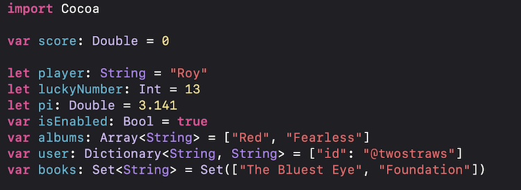

# Swift Fundamentals - Paul

<aside>
💡 Lessons learnt from Paul Hudson's 1 hour Swift essentials course + from other courses

</aside>

**Table of Contents :**

# Declarations:



Another way of declaring Array and Dictionaries:


Further samples:

```swift
var emptySet = Set<Int>()
var emptyArray = [Int]()
var array2D: [[Int]] = [[1, 2], [3, 4], [5, 6], [7, 8]]
var array3D: [[[String]]] = [[["A", "B"], ["C", "D"]], [["E", "F"], ["G", "H"]]]
var typeInferredSet : Set = [1, 3, 2]
let emptyDictionary = [Int : String]()
```

### Useful Functions:

```swift
// isMultiple
let number = 99
number.isMultiple(of: 3)

// Random
let rValue = Int.random(in: 1...100)

// Toggle
var isSaved = false
isSaved.toggle()
```

# Collections

### Array

```swift
// array: append, remove, contains
var arr = ["tiger", "lion"]
arr.append("elephent")
arr.remove(at: 0)
print(arr.contains("tiger") //results true
```

### Set

```swift
// set: insert, contains
var numbers = Set([1,1,3,5,7,9])
numbers.insert(10)
print(numbers.contains(11)) //works instantly even if we have 1million items

/*
Properties & Methods:
- isEmpty
- count
- insert()
- contains()
- remove()
- removeFirst()
*/

// Union, Intersection, Symmetric Diff
let animalsSet : Set = ["tiger", "cat", "lion", "dog", "cat", "cow", "hamster"]
let petSet : Set = ["dog", "hamster", "cat", "cow"]
let birdSet : Set = ["crow", "sparrow", "cuckoo"]
let commonSet = animalsSet.intersection(petSet) //finds the common members of the two sets
//Result {“cat”, “hamster”, “dog”, “cow”} 

let uncommonSet = animalsSet.symmetricDifference(petSet) //the opposite of intersection
//Result {“tiger”, “lion”} 

let mixedSet = petSet.union(birdSet) //adds two sets
//Result {“dog”, “sparrow”, “cat”, “crow”, “cow”, “cuckoo”, “hamster”} 

petSet.isSubset(of: animalsSet) //returns true if second set has all the values of the first set. here true
petSet.isDisjoint(with: birdSet) //to determine if two sets are completely different
animalsSet.isSuperset(of: petSet) //returns true if the first set has all the values of the second set. here true
```

### Dictionary

This is a key value type collection. The members of a dictionary are stored in pairs with a key. This key is unique, and like sets, the members are also unordered and are retrieved with the help of these keys.

```swift
// dictionary: default
let employee = [
	"name": "Bridney",
	"job": "Singer"
]
print(employee["job", default: "Unknown"])

// Properties & Methods:
mutableDictionary.values //returns a collection of all the values of the dictionary
mutableDictionary["key4"] = "value 4" //add a new member
mutableDictionary.updateValue("key1", forKey: "watermelon") //update an existing member
mutableDictionary["key3"] = "apple" //update an existing member using subscripts
mutableDictionary.removeValue(forKey: "key1") //remove value for a key
mutableDictionary["key4"] = nil //removes the value for a key. same as above

```

# Tuples

We saw Arrays, Sets, and Dictionaries. They are ordered, indexed but they are still strongly typed. You cannot store different types together. An array of type Int will only store Ints. This is where we can use Tuples. Tuples are small collections, where you can store different types of members together. They are used only when we must store simple data or if we have two return multiple values in a function.


```swift
var infoTuple = ("Adam", "Scott", 43, 09892356) //Creating a tuple
infoTuple.0 //accessing a tuple by its index Result: “Tom”
infoTuple.0 = "Tom" //modifying a tuple with the help of index

let labelledTuple = (name: "Adam", lastName:"Scott", age:43, tel:09892356) //A tuple with labels
labelledTuple.lastName //accessing a tuple by its label name
```

# Loops:

```swift
// for loop - array, range
let platforms = ["iOS", "macOS", "watchOS", "tvOS"]
for os in platforms {
	print("Swift works on \(os)")
}

for i in 1...10 {
	print("Number loop \(i)")
}

for _ in 1...5 {
	print("hello")
}

for (key, value) in mutableDictionary {
	print("key: \(key) - value: \(value)")
}

for value in mutableDictionary.values {
	print(value)
}

let iteratingString = "I am a Swift developer"
for character in iteratingString {
	print(character)
}

//closed range operator. starts at 0 and ends at 3
for index in 0…3 {
	print("index \(index) - \(mutableArray[index])")
}
//half open range operator. starts at 0 and ends at 2
for index in 0..<3 {
	print("index \(index) - \(mutableArray[index])")
}

for _ in 0…3 {
	print("loop executed")
}

//increment upto a count with an increment of 2 at each step
let interval = 2
for num in stride(from: 0, to: mutableArray.count, by: interval) {
	print(num)
}
```

# Func:

```swift
// func declaration
func roleDice() -> Int {
	return Int.random(in: 1...12)
}
print(rollDice())

// single return line can be modified like this.. 
func roleDice() -> Int {
	Int.random(in: 1...12)
}
```

### Returning Tuples

```swift
// func - returning tuple
func getUser() -> (firstName: String, lastName: String) {
	(firstName: "Superstar", lastName: "Rajinikanth")
}
let user = getUser()
print("Name \(user.firstName) \(user.lastName)")

// OR (with Destructuring)
let { firstName, _) = getUser()
print("Name \(firstName)")
```

### Underscore Usage

```swift
// func - underscore usage
func isUppercase(_ string: String) -> Bool {
	return string == string.uppercased()
}
let str = "HELLO WORLD"
let result = isUppercase(str)
```

### External, Internal Params

```swift
// here, `for` = external and `number` = internal
func printTimesTable(for number: Int) {
	for i in 1...12 {
		print("\(i) X \(number) is \(i * number)")
	}
}
printTimesTable(for:5)
```

### Default Value

```swift
// func - default value
func greet(_ person: String, formal: Bool = false) {
	if formal {
		print("Welcome, \(person)")
	}
	else {
		print("Hi, \(person)")
	**}**
}
greet("Tim", formal: true)
greet("Raj")
```

### Overloading Function


# Enum

Swift enumerations allow you to put related values together into a custom type.

By default enum cases return string value

```swift
// enum
enum Weekday {
	case monday, tuesday, wednesday, thursday, friday
}
var day = Weekday.monday
day = .friday
```

### Enum Sample


### RawValue


### Associated Values


# Closure

Closures are basically anonymous functions. A function without a name. A self contained package of functionality that can be passed around. 

```swift
// sample 1
let sayHello = {
	print("Hi, there!")
}
sayHello()

// sample 2
let sayHello = { (name: String) -> String in
	"Hi, \(name)!"
}
sayHello("Raj") //results - Hi, Raj!
```

### Shorthand Demo

```swift
// shorthands demo
let team = ["Gloria", "Suzanna", "Tiffany", "Tasha"]
let onlyT = team.filter({ (name:String) -> Bool in 
	return name.hasPrefix("T")
})
//OR shorthand 1
let onlyT1 = team.filter({ (name:String) in 
	return name.hasPrefix("T")
})
//OR shorthand 2
let onlyT2 = team.filter({ name in 
	return name.hasPrefix("T")
})
//OR shorthand 3
let onlyT3 = team.filter({ name in 
	name.hasPrefix("T")
})
//OR shorthand 4 
let onlyT4 = team.filter { $0.hasPrefix("T") }
//call the func now
print(onlyT)
```

# Struct

Structs are better suited to modeling simple objects that dont need inheritance or reference capabilities. 


> **Struct is immutable**
> 


Computed Property

```swift
//computed property
struct Employee {
	let name: String 
	var vacationAllowed = 14
	var vacationTaken = 0 

	var vacationRemaining: Int {
		get {
			vacationAllowed - vacationTaken
		}
		set {
			vacationAllowed = vacationTaken + newValue
		}
	}
}
```

### Property Observer

```swift
//property observers
struct Game {
	var score = 0 {
		didSet {
			print("Score is now \(score)")
		}
	}
}
var game = Game()
game.score += 10
game.score -= 3
```

### Initializer

```swift
//initializer
struct Player {
	let name: String
	let number: Int

	init(name: String) {
		self.name = name
		self.number = Int.random(in: 1...99)
	}
}
```

### Mutating

Four access modifiers:

1. public - open for all
2. private - private to the struct/class
3. private(set) - open for read and restricted for write within the struct/class
4. fileprivate - private with in the file


### Static

```swift
//static variable
struct AppData {
	static let version = "1.3 beta 2"
	static let settingsFile = "settings.json"
}

print(AppData.version)
```

# Class

Classess are well-suited to complex data structures

```swift
import Cocoa

class Employee {
    let hours: Int
    
    init(hours: Int){
        self.hours = hours
    }
    
    func printSummary() {
        print("I work \(hours) hours a day.")
    }
}

class Developer: Employee {
    func work() {
        print("I'm coding for \(hours) hours a day.")
    }
}

let novall = Developer(hours: 8)
novall.work()
novall.printSummary()
```

### Convenience Init


## Class vs Struct


### 1. Inheritance - override methods

```swift
// in continuation to above example.. 
//first diff - inheritance
class Developer: Employee {
    func work() {
        print("I'm coding for \(hours) hours a day.")
    }
		
		override func printSummary() {
        print("I spent \(hours) hours a day fighting over tabs vs spaces.")
    }
}
```

### 2. No default initializers

```swift
class Vehicle {
    let isElectric: Bool
    
    init(isElectric: Bool) {
        self.isElectric = isElectric
    }
}

class Car: Vehicle {
    let isConvertible: Bool
    // we need init values for inherited class as well.
    init (isElectric: Bool, isConvertible: Bool) {
        self.isConvertible = isConvertible
        super.init(isElectric: isElectric)
    }
}
```

### 3. Copy of objects

```swift
class Actor {
    var name: String = "Nicolas Cage"
}

var actor1 = Actor()
var actor2 = actor1

actor2.name = "Tom Cruise"
print(actor1.name) //prints 'Tom Cruise'
print(actor2.name) //prints 'Tom Cruise'

//if we convert Actor class as Struct then the results will be different. 
...
print(actor1.name) //prints 'Nicolas Cage'
print(actor2.name) //prints 'Tom Cruise'
```

### 4. Deinit

```swift
class Site {
    let id: Int

    init(id: Int){
        self.id = id
        print("Site \(id): I've been created")
    }
    
    deinit {
        print("Site \(id): I've been destroyed!")
    }
}

for i in 1...3 {
    let site = Site(id: i)
    print("Site \(site.id): I'm in control")
}
//this code prints 'created, control, destroyed' messages 3 times.
```

### 5. Constant class instance

Even if the class object is constant the inside variables can be changed

```swift
class Singer {
    var name: String = "Adele"
}

let singer = Singer()
singer.name = "Justin"

print(singer.name) //prints 'Justin'
```

<aside>
💡 **The Right Choice

Struct** - simple, encapsulated object needs + copied
**Classes** - anything needing to be passed by reference + uses inheritance

</aside>

**More read on this topic on Apple’s documentation :**

[https://developer.apple.com/documentation/swift/choosing_between_structures_and_classes](https://developer.apple.com/documentation/swift/choosing_between_structures_and_classes)

## Access Modifiers and Properties

There are 4 types of access modifiers

- **public** - Public entities can be freely accessed from inside their source file, as well as any separate module that imports the parent module
- **internal -** Internal entities can be accessed by any source file within their defining module, but no where else. (Every entity in Swift is set as internal by default)
- **fileprivate -** Fileprivate entities can only be accessed inside their defining module
- **private -** Private variables can only be accessed inside their declaration scope

## Computed Property - Get, Set


## Static Vs Class variables


Static, Class are the type property flavours 

**Static Types** can not be overritten in a sub class. but **class** variable can be overridden in a sub class.. and class variables can only be computed properties

## Subclassing


**Subclassing Sample:**


# Protocol

Its a way to enforce minimum functionality implementations. Classess and Structs using the protocol should conform to the specific methods in the protocol. 

```swift
protocol Vehicle {
    var name: String { get }
    var currentPassengers: Int { get set }

    func estimateTime(for distance: Int) -> Int
    func travel(distance: Int)
}

struct Car: Vehicle {
    let name = "Car"
    var currentPassengers = 1

    func estimateTime(for distance: Int) -> Int {
        distance / 50
    }
    func travel(distance: Int) {
        print("I'm driving \(distance)km")
    }
    func openSunroof() {
        print("It's a nice day!")
    }
}
func commute(distance: Int, using vehicle: Vehicle){
    if vehicle.estimateTime(for: distance) > 100 {
        print("Too slow!")
    } else {
        vehicle.travel(distance: distance)
    }
}
let car = Car()
commute(distance: 100, using: car) //prints 'I'm driving 100km'
```

### Another sample

**Problem with inheritance:**


**Solution from protocol**:

`CanFly` is a protocol here. 


### Superclass + Protocol Order


# Extension

It enables the user to add new functionality to the existing types

```swift
extension String {
    func trimmed() -> String {
        self.trimmingCharacters(in: .whitespacesAndNewlines)
    }
    
    //alternative approach
    mutating func trim() {
        self = self.trimmed()
    }
    
    //computed property
    var lines: [String] {
        self.components(separatedBy: .newlines)
    }
}

var quote = "      Strike when the iron is hot   "
let trimmed = quote.trimmed() //prints 'Strike when the iron is hot'
quote.trim() //trims the string and assign it back to itself

let lyrics = """
But I keep cruising
Can't stop, won't stop moving
"""

print(lyrics.lines.count) //prints 2
```

## Protocol Extensions

It allows to add **computed properties and methods** to the whole protocol. So any types conform to the protocol get access to them.

```swift
extension Collection {
    var isNotEmpty: Bool {
        isEmpty == false
    }
}

let guests = ["Mario", "Luigi", "Peach"]

if guests.isNotEmpty {
    print("Guest count: \(guests.count)")
}
```

# Optionals

Optionals represent the absence of data. Any data type can be an optional

There are 5 different ways on working with **Optionals** 


### Unwrapping - If let

```swift
let opposites = [
    "Mario": "Wario",
    "Luigi": "Waluigi"
]

let peachOpposite = opposites["Peach"]

if let marioOpposite = opposites["Mario"] {
    print("Mario's opposite is \(marioOpposite)")
}
```

### Unwrapping - Guard

Guard can also be used for optional unwrapping. It is the opposite of 'if let'. However it works with any condition. 

```swift
func printSquare(of number: Int?) {
    guard let number = number else {
        print("Missing input")
        return  // this is mandatary
    }
    
    print("\(number) * \(number) is \(number * number)")
}
```

### Unwrapping - Nil Coalesing

```swift
let tvShows = ["Archer", "Babylon 5", "Ted Lasso"]
let favorite = tvShows.randomElement() ?? "None" // bcoz randomElement may return optional nil

let input = ""
let number = Int(input) ?? 0
print(number) //prints 0
```

### Optional Chaining

```swift
let name = ["Arya", "Bran", "Robb", "Sansa"]
let chosen = name.randomElement()?.uppercased()  //optional chaining
print("Next in line: \(chosen ?? "No one")")
```

### Optional try

```swift
// try?
enum UserError: Error {
    case badID, networkFailed
}

func getUser(id: Int) throws -> String {
    throw UserError.networkFailed
}

if let user = try? getUser(id: 23) {
    print("User: \(user)")
}
```

## Throwing Errors


### Catching Errors


