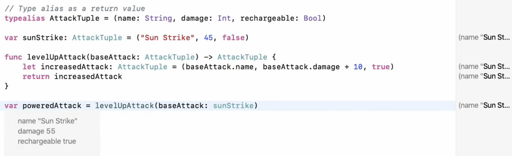
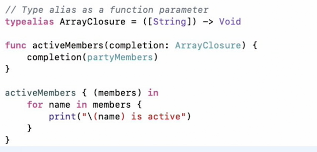

# Closures

[Refer additional Notes from `donnywals.com`](/Swift/Closures2.md)

Closures are basically anonymous functions. A function without a name. A self contained package of functionality that can be passed around.

## Creating Basic Closures

Swift lets us use functions just like any other type such as strings and integers. This means you can create a function as assign it to a variable, call the function using that variable, and even pass that function into other functions as parameters.

Functions used in this was are called `closures`, and although they work like functions they are written a little differently.

```swift
let driving = {
	print("I'm driving in my car")
}
```

That effectively creates a function without a name, and assigns that function to driving. You can now call `driving()` as if it were a regular function.

### **Declaring Closure**

```swift
// Defining
var closure: () -> () = {}

//initializing
var computeBonusDamage: (Int) -> Int = { (base: Int) -> Int in
	return base * 4
}
```

### Using Closures

```swift
var highScores = [350, 497, 425, 399]
var partyMembers = ["Raj", "Kumar", "Raja", "Senthil"]

// Existing function with closure
var ascendingSort = highScores.sorted { (firstVal, secondVal) -> Bool in
	return firstVal < secondVal
}
print(ascendingSort)

// Using custom closures with functions
func activeMembers(completion: ([String]) -> Void) {
	completion(partyMembers)
}
activeMembers { (members) in
	for name in members {
		print("\(name) is active!")
	}
}

// Another approach with closure return
func activeMembers(members: [String]) -> () -> Void {
	let completion: () -> Void = {
		for name in members {
			print("\(name) is present!")
		}
	}
	return completion
}
var closureReturn = activeMembers(members: partyMembers)
closureReturn()
```

### Type Aliasing

Defining a tuple with typealias and using it in functions below:



**TypeAliasing with CLosure**


