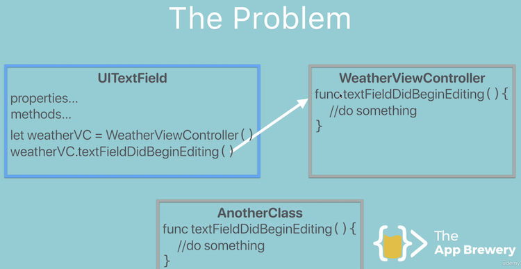
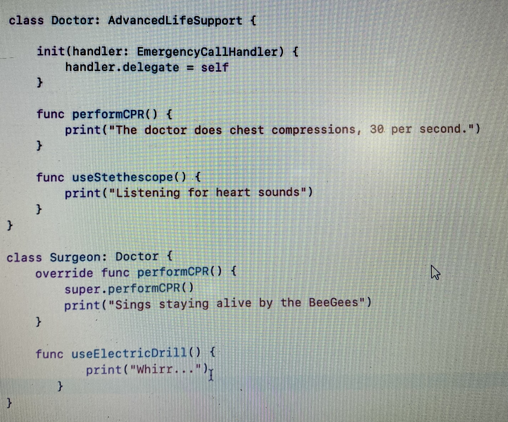
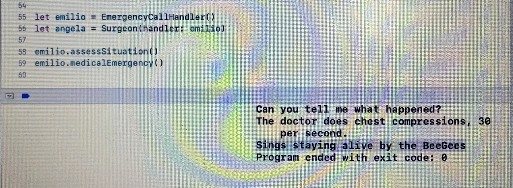

# Swift - Design Patterns

Design pattern is a proven solution to a common problem. 

Three types of design patterns

1. Creational
2. Structural
3. Behavioral

## Creational

### Singleton

Ensures a type has only one instance 

Use of Singleton - Access and manage a single resource

## Delegate Design Pattern



**Solution**


**Protocol + Delegate Sample:**


```swift
let emilio = EmergencyCallHandler()
let pete = Paramedic(handler: emilio)

emilio.assessSituation()
emilio.medicalEmergency()
```



