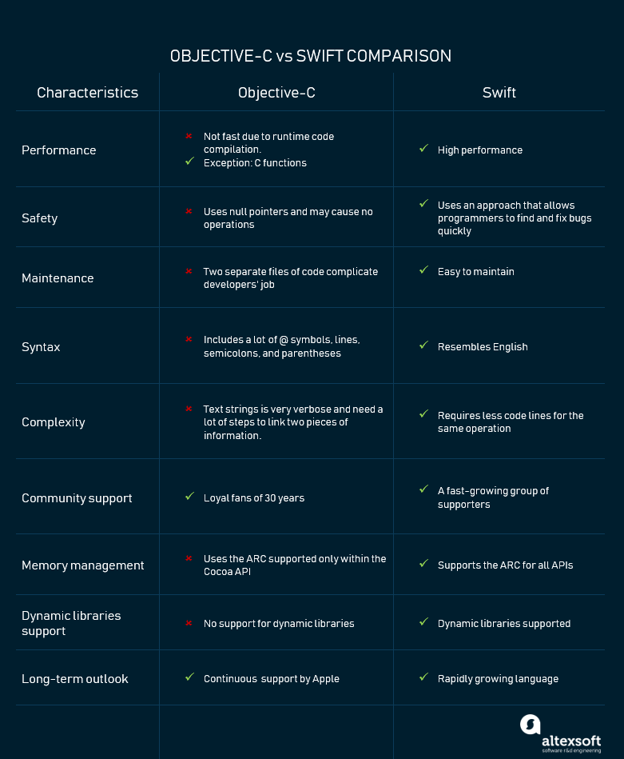
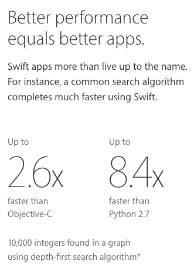
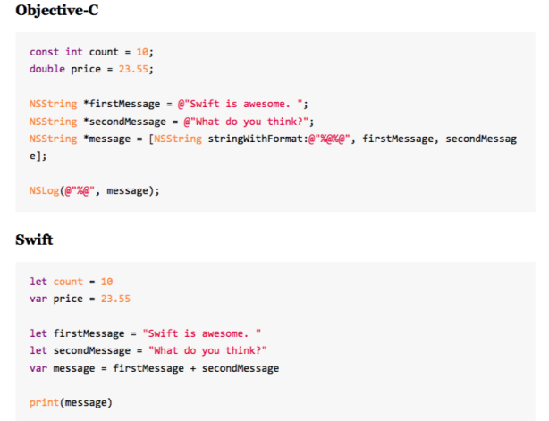

# Swift Vs Objective C

### Further Reads:

- [https://mlsdev.com/blog/swift-vs-objective-c](https://mlsdev.com/blog/swift-vs-objective-c)

# Objective-C uses the runtime code compilation

Objective-C isn’t a fast language. The main reason is that it uses the runtime code compilation, rather than the compile time. This means that when the Objective-C object calls for another object in the code, there is an extra level of indirection involved. Generally, this happens very fast but when the code compilation happens a significant number of times, it becomes measurable. Objective-C is a superset of C and all C functions that you will write in Objective-C will be just as fast. Developers who write the performance-sensitive code often go back to clear C for those inner loops.

# Swift was made to be swift

Swift language is a good choice for performance-sensitive code. According to many [tests](https://www.primatelabs.com/blog/2014/12/swift-performance/), it shows the performance close to C++ for the FFT algorithms. Swift also outperforms C++ for the Mandelbrot algorithm. Because Swift is still a young language, we can expect even more enhancements soon.

# Safety

Swift was designed to improve the code safety for iOS products. It was created as a type-safe and memory-safe language. Type safety means that the language itself prevents type errors. The importance of type memory safety is that it helps avoid vulnerabilities associated with dangling or uninitialized pointers. These types of errors are the most common in development and difficult to find and debug. These advantages of the Swift language make it more attractive

# Objective-C approach with null pointers

What’s important to understand about Objective-C’ safety is that it uses null pointers. The pointer is the component of C++ and other C-based languages and it can cause vulnerabilities in security. It’s the method for exposing values that gives developers higher access to the data. The thing with pointers is the way they are handled. In Objective-C when you try to call a method with a nil pointer nothing happens. Then expressions and a line of code become a no-operation (NOP). At first sight, it could seem beneficial because it doesn’t cause a crash, but actually, it may be an extensive source of bugs. A NOP causes unpredictable results that complicate the process of finding and fixing bugs.

## Syntax

# Memory management

Objective-C language supports the Automatic Reference Counting (ARC) inside of the object-oriented code itself. The issue is that it cannot access C code and other APIs as Core Graphics. On the contrary, Swift is more consolidated, and its ARC is complete for procedural and object-oriented paths. Due to this fact, huge leaks of memory with the Swift language are impossible.

# Objective-C memory management within the Cocoa API

Objective-C uses the ARC supported within the [Cocoa API](<https://en.wikipedia.org/wiki/Cocoa_(API)>). ARC is a feature for both Objective-C and Swift languages that manages memory with no programmer effort. The problem is that the code isn’t available for procedural C and some other APIs like Core Graphics. This impacts memory management and causes extensive memory leaks.

# Swift supports ARC not only for the Cocoa Touch API’s

The Swift language also uses ARC. The difference is that Swift supports the ARC for all APIs that allow a streamlined way for memory management similar to Cocoa Touch. The issues with Objective-C are solved by making ARC complete with the object-oriented code paths. It saves developers’ time and helps them be less about memory management.

# Dynamic libraries support

Dynamic libraries are the executable parts of code that can be linked to an app. The difference between dynamic libraries and static libraries is that dynamic libraries can be linked to any program during run-time. The shared code is loaded once and can be used by a large number of programs. This code can be updated, changed or recompiled without recompiling the application that uses this library. Dynamic libraries are automatically included in the AppStore’s download package. Static libraries are linked at the last step of the compilation process after the program is placed in memory. As a result, the executable file must be recompiled in case any changes were applied to external files. Static libraries are also updated along with other updates like a new OS version. Dynamic libraries can update pieces of code directly in an app.

# Objective-C uses static libraries

Objective-C doesn’t support dynamic libraries and this is a major disadvantage. The thing is that they are larger in size because external programs are built in the executable files. Dynamic libraries are smaller because only one copy of dynamic library is being stored in memory. So, if you choose to stay with Objective-C, you should recognize that you will ignore the dynamic libraries support provided by the Swift language.

# Swift supports dynamic libraries

Dynamic libraries supported by Swift are loaded directly into an app’s memory and optimize the app’s performance. Direct connection with the app allows them to be updated independently from the OS. It helps keep your solution current, reduces the app size, and speeds up the load time of new content.

# Making the choice: use cases for both languages

When choosing a programming language, you should first and foremost consider you team’s experience and the project’s specifications. For example, if you already have developers skilled in Objective-C, it’s a bad practice have to them migrate to Swift. There are several instances in which you want to stick to the good, old Objective-C and here they are.

**When maintaining an existing project**. When your app is already written in Objective-C and you need to update it, better use Objective-C. Technically you can code in both languages for the same project since Objective-C and Swift are interoperable. However, maintaining an app developed in two languages is complicated – you need developers proficient in both languages and they constantly have to switch between languages.

**When using C or C++ framework.** As we described above, Objective-C is the superset of C and if the project requires the C or C++ framework, using this language is the logical thing to do.

**When your app needs to support old iOS versions.** Swift supports only new iOS versions from iOS 7 and macOS 10.9 and higher. In case your app has to support the older versions, you have no choice but to use Objective-C.

**When you’re short on time.** Swift is easy to learn, but like any skill it takes time and effort to master. If you can’t wait for your team to learn a new language, continue using Objective-C.

**When you have a large project.** Swift is a rapidly developing but young language. One of its biggest cons is the lack of backward compatibility. Meaning that when Swift updates you have to completely rewrite your app for a new version. When you create a small app, rewriting is much easier. But in the case of big projects, you wouldn’t want to update your whole program with each version release.

### **_Usage of constants & Optionals_**

- Swift allows and encourages the use of constants much more than C ever did. The optimizer can assume that constants never change — even backdoor techniques like forming an UnsafePointer to the constant are banned — and so it can safely cache previously-fetched values and perform other optimizations.
- Optionals ensure that certain pointers can never be nil, so the compiler can omit nil checks.

### **_Some more points to note_**

- Swift objects can call one another without needing to perform the message sending which was a bottleneck on Objective-C performance.
- Objective-C’s objects come with magical properties which allows introspection and dynamic handling of messages. This is super powerful, but adds a cost to every single message.
- Swift objects don’t require this. So can be much more lightweight. In theory there’s no reason why Swift code could not be as fast as C++.
- In simple tests, with the optimiser set to “11”, Swift code seems to have a similar performance to C / C++.
