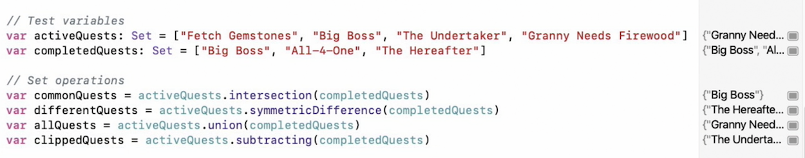
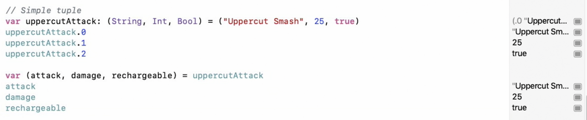
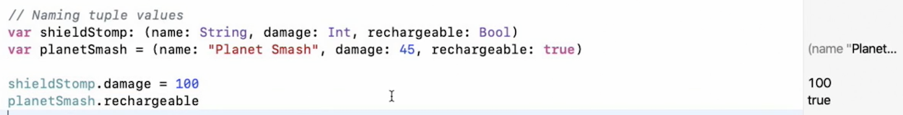
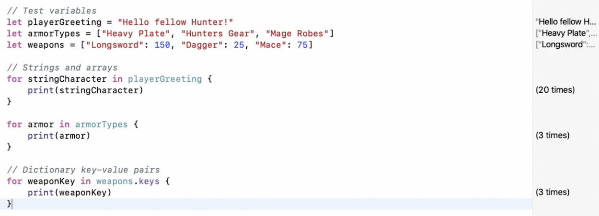
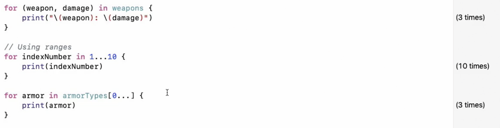
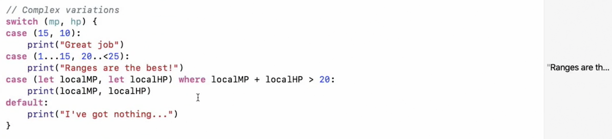
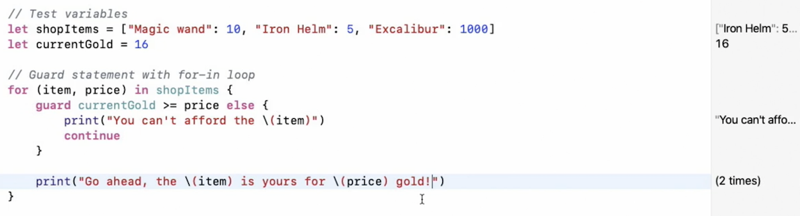
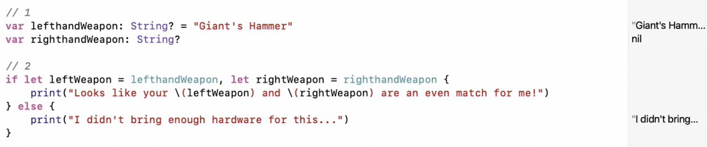

# Working with Collections

# Collections

### Arrays

Swift Arrays are ordered lists, meaning that the position of each element is determined by the order it was added. Array work off of indexes, which can be used to access and modify the values of individual items. 

### Dictionaries

```swift
var dict1 : [String: Int] = [”one”: 1, “two”: 2, “three”: 3]
dict1["two"] = 200

//to get all the available keys
let allKeys = [String](dict1.keys)
//to get all the values
let allValues = [Int](dict1.values)

//caching and overriding items
var oldValue = dict1.updateValue(30, forKey: "three") //results 3

//this completely overrides the dictionary with new items
dict1 = ["four": 4, "five": 5]

// to remove item
dict1["four"] = nil
// remove and cache old value
let removedValue = dict1.removeValue(forKey: "four") // results 4

//nested dictionary should be called with ?
let weather = dict2["city"]?["chennai"]

```

### Set

Set only stores the unique values

```swift
//always specify the type while declaring Set
var cities: Set<String> = ["Chennai", "Bangalore", "Mumbai", "Kolkata"]
// OR
var cities: Set = ["Chennai", "Bangalore", "Mumbai", "Kolkata"]

//insert, remove items
cities.insert("Delhi")
cities.remove("Mumbai")

//contains
cities.contains("Chennai") // results true
//sorting
cities.sorted()
```

**Set Operations (Union, Intersection etc...)**



### Tuple



**Named Tuples**



# Control Flow

### **For Loop with collections**





### Switch



### Guard



### if let

