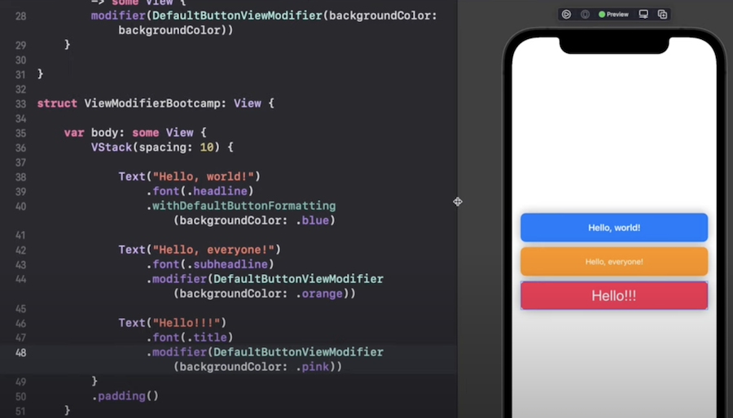

# SwiftUI Advanced

## ViewModifiers

Viewmodifier is an object combing bunch of styles and intended to use in other controls to bring same look and feel. Check below code and sample UI display.


We can create a custom view extension with a function for the modifier. Sample below.


Here the line# 28 is the shothand version of `self.modifier(DefaultButtonViewModifier()`

We can even customize the modifier to have some dynamic parameters.



# Custom ButtonStyle

We can customize how a button can interact during touch events. Sample below:


We can create custom view extention for this..


# MatchedGeometryEffect

Below sample shows a pretty basic animation during state change.


If apply the animation via matchedGeometryEffect:


Basicallt the code identifies both the rectangles as a single rectangle so the animation kick started while changing the state..

```swift
// With different shapes..
VStack{
    if !isClicked {
        Circle()
            .matchedGeometryEffect(id: "rect", in: namespace.self)
            .frame(width: 100, height: 100)
    }
    Spacer()
    if isClicked {
    RoundedRectangle(cornerRadius: 25.0)
            .matchedGeometryEffect(id: "rect", in: namespace.self)
        .frame(width: 300, height: 200)
    }
}
.frame(maxWidth: .infinity, maxHeight: .infinity)
.background(.red)
.onTapGesture {
    withAnimation(.easeInOut) {
        isClicked.toggle()
    }
}
```

Another production example of matchedGeometryEffect is to bring the horizontal menu with highlight.. sample here:


The rectangle nicely moves across the menu items.

# Custom Shapes

SwiftUI comes with build in shapes like rectangle, circle etc.. however we can make our our shapes by creating views based on Shape & Path objects.. Below shows the creation of a triangle.


We can used our custom shapes to clip images..


Further shape samples..


# Generics

If we want some functionality to be utilized in many types then we can use Generics.

```swift
import SwiftUI

struct GenericModel<T> {
    let info: T?
    func removeInfo() -> GenericModel {
        GenericModel(info: nil)
    }
}

class GenericViewModel: ObservableObject {
    @Published var StringModel = GenericModel(info: "Hello Chennai!")
    @Published var BoolModel = GenericModel(info: true)
    func removeData() {
        StringModel = StringModel.removeInfo()
        BoolModel = BoolModel.removeInfo()
    }
}

struct Generics: View {
    @StateObject var vm = GenericViewModel()

    var body: some View {
        VStack {
            Text(vm.StringModel.info ?? "no data")
            Text(vm.BoolModel.info?.description ?? "no data")
        }.onTapGesture {
            vm.removeData()
        }
    }
}
```

Views can also utilize generics feature.. sample below.


The only difference is that we need to specify that the generic type to be conforming to the view protocol.

# @ViewBuilder

Viewbuilder is a custom parameter attribute that constructs views from closures. ViewBuilder works behind the scenes of many common SwiftUI views - like VStack and HStack.

```swift
import SwiftUI
struct Header<Content:View>:View {
    let title: String?
    let content: Content?
    init(title: String,
         @ViewBuilder content: () -> Content){
        self.title = title
        self.content = content()
    }
    var body: some View {
        HStack {
            VStack(alignment: .leading) {
                Text(title ?? "")
                    .font(.title)
                    .fontWeight(.bold)
                content
                RoundedRectangle(cornerRadius: 20.0)
                    .frame(width: .infinity,
                           height: 2)
                Spacer()
            }
            .padding()
            Spacer()
        }
    }
}
struct ViewBuilderDemo: View {
    var body: some View {
        Header(title: "Motivation") {
            HStack {
                Image(systemName: "heart.fill")
                Text("Do great job!")
            }
        }
    }
}
```


Another usage of ViewBuilder is to use on the property that returns a view dynamically based on a condition. Sample below:

```swift
struct DescriptionView: View {
    enum ContentType {
        case quote, description
    }
    let type: ContentType?
    init(type: ContentType){
        self.type = type
    }
    @ViewBuilder var bodyContent: some View {
        if type == .quote {
            Text("Strike when the iron is hot")
        }
        else {
            Text("Grab the opportunity ASAP.")
        }
    }
    var body: some View {
        bodyContent
    }
}
struct ViewBuilderDemo: View {
    var body: some View {
        VStack {
            Header(title: "Motivation") {
                HStack {
                    Image(systemName: "heart.fill")
                    Text("Do great job!")
                }
            }
            DescriptionView(type: .quote)
            Spacer()
        }
    }
}
```


# SwiftUI Data Flow

Value types use **@State, @Binding, Property**

Reference Types use **@StateObject, @ObservedObject, @EnvironmentObject**


