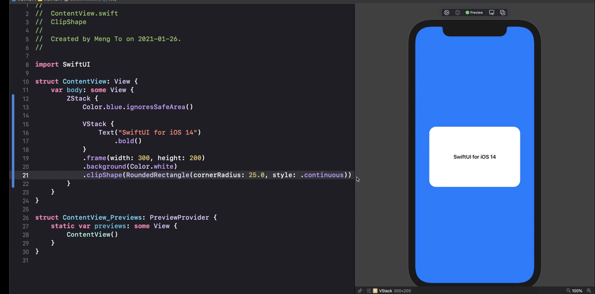
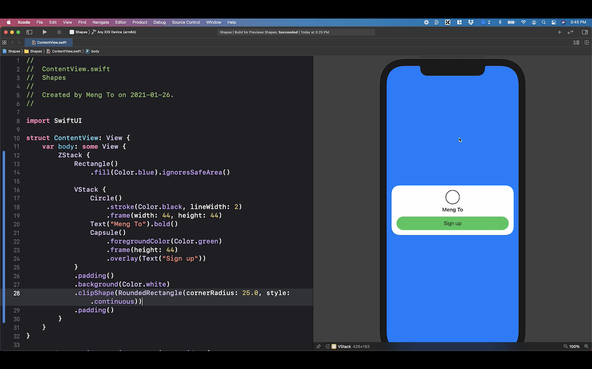
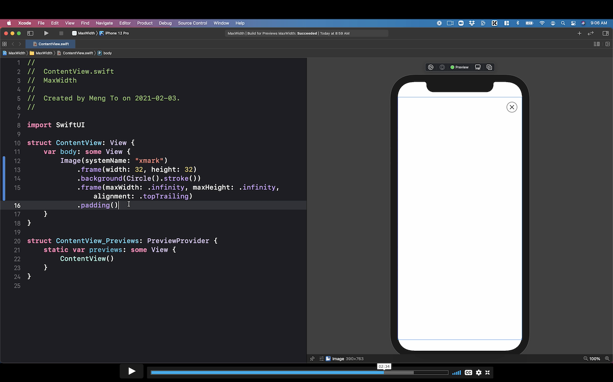
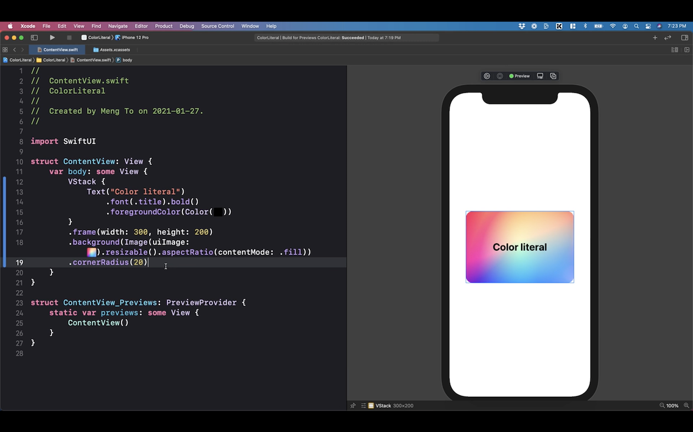
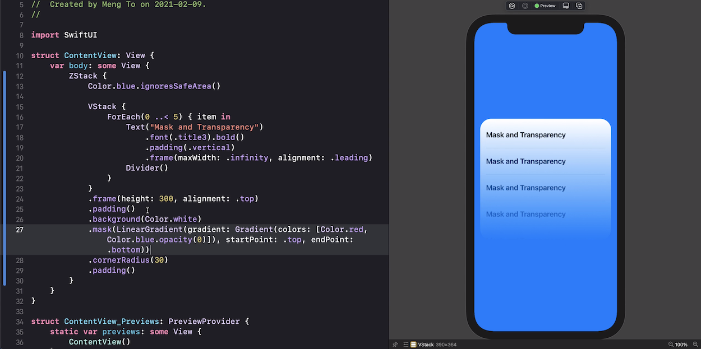
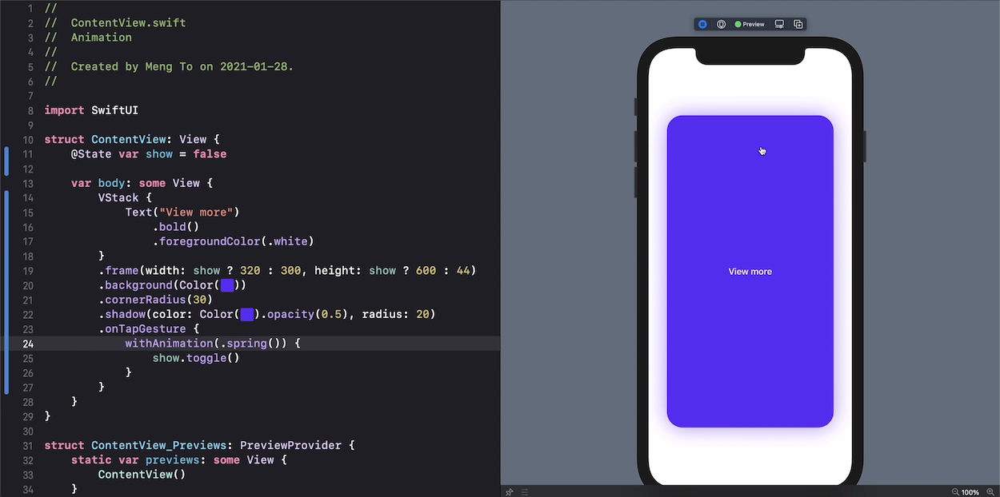
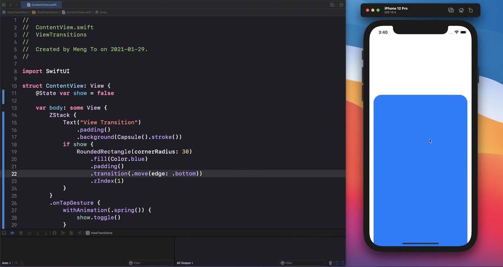

# SwiftUI Cookbook

This page contains a collection of recipes for SwiftUI views and layouts.

## Clip shape and smooth corners

## Card style with VStack

## Corner alignment with double frame

## Gradient background

## Mask & Transparent

## Default WithAnimation

## Transition & Animation

