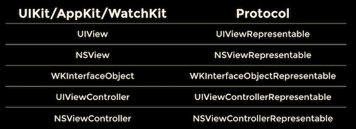

# SwiftUI Basics

Below content is an excerpt From - Mastering SwiftUI (Supports iOS 14 and Xcode 12) Book By Simon Ng

## Imperative Vs Declarative

Instead of focusing on programming, let's talk about cooking a pizza. Let’s assume you are instructing someone else (a helper) to prepare the pizza, you can either do it imperatively or declaratively. To cook the pizza imperatively, you tell your helper each of the instructions clearly like a recipe:

- Heat Oven
- Prepare dough
- Roll out dough
- Spoon tomato sauce
- Place toppings
- Bake the pizza for 10 minutes

On the other hand, if you cook it in a declarative way, you do not need to specify the step by step instructions but just describe how you would like the pizza cooked. Thick or thin crust? Pepperoni and bacon, or just a classic Margherita with tomato sauce? 10-inch or 16-inch? The helper will figure out the rest and cook the pizza for you.

That's the core difference between the term imperative and declarative.

## The Combine Approach

If you are an experienced developer, you may find it strange that SwiftUI doesn't use a view controller as a central building block for talking to the view and the model.

Communications and data sharing between views are now done via another brand new framework called Combine.

## Learn once, apply anywhere

With SwiftUI, Apple offers developers a unified UI framework for building user interfaces on all types of Apple devices. The UI code written for iOS can be easily ported to your watchOS/macOS/watchOS app without modifications or with very minimal modifications. This is made possible thanks to the declarative UI framework.

The beauty of this unified framework is that you can reuse most of the code on all Apple platforms without making any changes. SwiftUI does the heavy lifting to render the corresponding controls and layout.

## Interfacing with UIKit/AppKit/WatchKit

SwiftUI is designed to work with the existing frameworks like UIKit for iOS and AppKit for macOS. Apple provides several representable protocols for you to adopt in order to wrap a view or controller into SwiftUI.

The representable protocols for existing UI frameworks:


### Porting WKWebView to SwiftUI

```swift
import SwiftUI
import WebKit

struct ContentView: View {
    var body: some View {
        WebView(url: "https://www.apple.com")
    }
}

struct WebView : UIViewRepresentable {
    let url: String

    func makeUIView(context: Context) -> some UIView {
        let webView = WKWebView()
        webView.load(URLRequest(url: URL(string: url)!))

        return webView
    }

    func updateUIView(_ uiView: WKWebView, context: Context) {

    }
}
```
