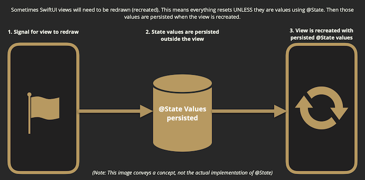

# Working with Data

> Struct variables are immutable unless we add 'mutating' keyword to the func.

### Property Wrappers

- @State
- @Bindings

Struct variables can have default value within the struct.. and while creating the struct we can pass new value to override that variable. But after that we can't change. 

- when we use @State property wrapper we can make changes to that variable.
- if you want to prevent changing the @State variable then make it as private
    - @State private var name : String = "Mani"
    

You just saw @State being used for the first time. When you see the symbol “@“ used as a prefix, it means it is a `property wrapper`. Property wrappers are kind of like extensions for properties.  You can add functionality and extra logic to a property using these property wrappers. 

The purpose of @State is to: 

- Make struct variables mutable
- Persist values when view is redrawn

Every time the state variable is changed, the views that it affects are redrawn.

Modifying a @State variable value does at least two things. 

1. Stores our value outside of the struct. 
2. Recreates our view without losing the state variable value.

### Two way binding

Two-way Binding ($name).The $ allows data to go back up to the property.

**TextField("Enter name", text: $name)**

Every time a letter is typed into the TextField, the new value is saved to the @State variable and the related view is redrawn.

**Group multiple single source for truth into a single struct object:** 

<aside>
💡 But if we use class instead of struct then the two way binding will not work.. 
For read-only data or one-way binding, you probably don’t need to use @State since the values aren’t changing. Can you use classes for data binding? Yes! There is a way to use classes to achieve two-way bindings but you won’t learn about that until later, when ***ObservableObject*** is introduced.

</aside>

## Binding

..

..

..

### Binding with list

## Observable Object

<aside>
💡 `@StateObject` is used to persist clases only.

With `@Published`, your ObservableObject can push data changes to the UI.Now you will see this Text show the published data.

</aside>

..

..

..

## @StateObject