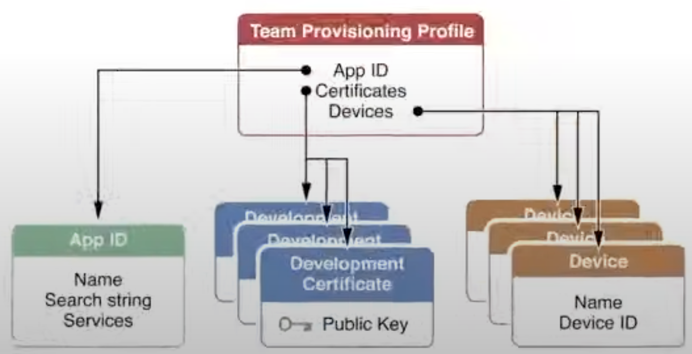
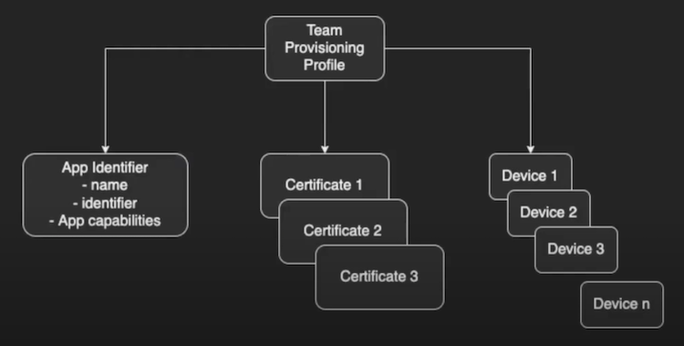
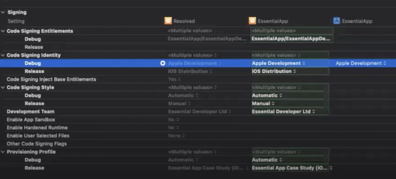
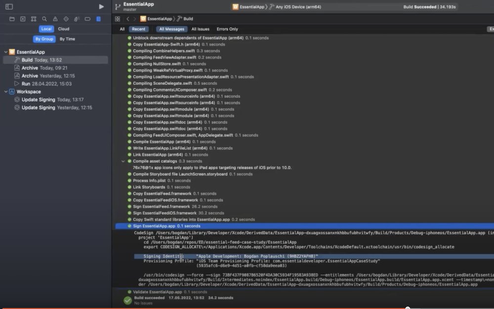

# Code Signing

Notes taken while watching youtube videos on the topic

## Why?

- Code signing

After a code/app is signed then it can not be modified. This gives the security on the content reliability.

The way the code signing is done in Apple is with provisioning profile and certificates

### Provisioning Profile

Unlike Android, apps cannot directly run on any device. It has to be signed by Apple first

- Provisioning profile acts as a link between device and developer account
- it decides that app can run on what all devices and what all services can be accessed by the app
- Before the IPA is made, the profiles are downloaded from the developer account (or picked from the machine) embeded in the bundle and then the bundle is code-signed using certificates.

**What does a profile contains:**

- Development certificates
- Unique device identifiers (list of device that the app can run on)
- App ID(An App ID is a two part string used to identify one or more apps from a single development team)

### How does an app install from Xcode

- The developer certificate mentioned in your provisioning profile is checked against the certificates saved in your Mac’s keychain
- This certificate is used to sign the code.
- The device on which you are running, it’s UUID is checked against the IDs mentioned in the provisioning profile.
- Bundle Identifier of the app is checked against the App ID in the provisioning profile.
- Entitlements required by your app are verified against the associated ones with your App ID.

If all goes well, the app is installed in the device.

### Types of Provisioning Profile

- Development
  - It will be used on daily basis.. and it has the local devices info
  - Cant use this to distribute app
- Ad Hoc
  - Used later in the development process
  - Used to distribute your app to a small or medium size group of testers that are not included in the iOS developer program for your organisation.
  - App with ad-hoc profile will be almost identical to the version you submit to the App Store
- Enterprise
  - Used on later development process
- Distribution
  - This would nt have any device identifiers since this will be used to distribute on App Store
  - If it is used then the app can be installed on any device thus Apple code signs it.

### How code signing works

- Signing the app allows iOS to identify who signed the app and to verify that your app hasn’t been modified since you signed it.
- The signing Identity consists of a public-private key pair that Apple created for you.
- Assymetric Cryptography

### Certificate Signing Request

- A CSR or Certificate Signing request is a block of ecoded text that is given to a Certificate Authority when applying for a certificate
- Keychain Application will create a private key(private key will be stored in the keychain) and a certSigningRequest file which you’ll then upload to Apple.
- Apple will proof the request and issue a certificate for you.
- The Certificate will be pushed into the Keychain and paired with a private key to form the Code Signing Identity.
- Finally, at the time of app installation, the private key used to sign the app matches the public key in the certificate. If it fails, app is not installed.

---

# Code Signing

**Below notes are taken while watching EssentialDeveloper lecture on Code-signing topic.**

Code signing is essential for any software products. It ensures trust in user.

- Installer Packages(.pkg) must be signed with Developer ID Installer Certificate
  - Developer ID Installer Certificate must be installed in the device
- If you sign your disk images(.dmg), they must be signed with Developer ID Application Certificate
  - Developer ID Application Certificate must be installed in the device

## Overview

- Introduced with the iOS Appstore from the beginning
- Its a security technology
- It certifies the app was created by the listed author
- The system can detect any changes to a signed app.
  - It can detect whether the change is introduced accidentally or by a mallicious code
- We participate as developer: signing identity and we sign the apps
  - Apple vouches for our signing identity
- Allows the OS to:
  - Ensure the code was not altered after it was signed
  - Identify code as coming from a specific source
  - Determine if the code is trustworthy
- Built on X.509 standard

**Code signing certificate:**

- A certificate contains an identity and a public key
- Certificate binds identity to public key using a digital signature
  - Public key types: SA, DSA, CDSA
- Certificates will either signed by certificate authority like Apple or it can be self-signed
- Public key(shared with the certificate authority) + Private key (not shared)
  - Code signing is done by using the private key
  - Public key is used to verify the code-signing

### Certificate Signing Requests (CSR)

- Message from applicant to a Certificate Authority (Apple)
- Used to apply for a digital identity certificate
- Created using the Mac Keychain Access app - Certificate Assistant
  - Goto **Keychain Access app > Main menu > Certificate Assistant > Request a Certificate from a Certificate Authority** and follow the steps
  - Once its done then you will have a file called **CertificateSigningRequest.certSigningRequest**
  - This file can be uploaded to [developer.apple](http://developer.apple) site to create a new certificate
  - As part of this process the Keychain Access app also creates a pair of public and private keys and it will be stored locally

### Certificates

- Electronic document that proves an identity
- Contains the Public key + additional info (name, email, …)
- Its important that the certificate is signed by Apple ⇒ so that the certificate is correct
- To create a certificate
  - Goto [developer.apple.com](http://developer.apple.com)
  - Goto `Certificates, Identifiers & Profiles > Create a New Certificate`
  - Under ‘Software’ select `Apple Development` and click ‘Continue’
  - In the next screen upload the generated CSR file then click ‘Continue’
  - Now we have the certificate
  - Click ‘Download’ button to download the certificate locally. The name would be `development.cer` Double tab on it to install it on local Keychain access. You may find the certificate under `login > My Certificates` tab
  - The certificate name will be on the developer account name, not the one we gave during CSR creation.
- Types of Certificates
  - Development - Used during development phase to install the app on our devices.
  - Distribution - This option is used to share the app with other people
    - Multiple ways of sharing with the distribution certificate
      - Create an `ad-hoc` build and send the **ipa** file to other people
      - Third party - firebase distribution
      - Create enterprise builds with enterprise account and share
      - Create app-store build and share via **Test-Flight**
- To share the certificate and the private key with the team, we can export them from keychain as a `p12` file. This file will have the certificate and the private key and it is protected with a password. Make sure you keep the password.
  - To import the certificate and the private key on the other machine, just transfer the `p12` file and double tap it and provide the password

### Apple Developer Account Types

- Personal developer account
  - free
  - install, debug, and builds on your devices
  - you cannot use this account to share build with others or to upload on app store
- Company (personal) developer account
  - Apple’s Developer Program ($100 per year)
  - Share builds internally (**AdHoc**) or externally (**TestFlight**, **AppStore**)
- Enterprise company account

  - Apple’s Developer Enterprise Program ($300 per year)
  - Only for internal use and distribution of proprietary apps

- Each Developer account has a unique identifier.
  - to check the identifier goto **Xcode > Build Settings, Under Signing section** hover over the ‘Development Team’ value. You will see the identifier

### App Identifier

- Its an unique combination of **Team identifier + Bundle Identifier**.
- App Identifiers are unique across the Apple Developer Portal
  - Two accounts cannot have the same App Identifiers
- It has supported platform info and the capabilities info
  - E.g. Push notifications, Game Centre, Sign-In with Apple, …
- Explicit App Identifier: `in.selvarajan.Aangilam`
- Wildcard App Identifier: `in.selvarajan.*` or even `*`

### Device Identifier

- Each iOS device has a unique identifier (UDID)
  - Example: 00008030-001268920200402E
- In order to install the development / adhoc builds on your device then the device identifier has to be listed on the apple developer portal devices and added to provisional profile.
- To see the device identifier goto `Xcode > Window > Devices & Simulators` and check the identifier of the connected phone.

### Capabilities / Entitlements

- Access to Apple Services : Cloud Kit, Game Center, In-App Purchases, Signing with apple, Push notifications etc
- Controlled via
  - Apple Developer Portal: App Ids / Services or Capabilities
  - Xcode: Target Signing & Capabilities ⇒ Entitlements.plist
- Once we add a capability Xcode automatically creates an Entitlement file.
  - During the build time the entitlement file content is compared against the capabilities & services enabled for the app identifier. If they dont match, the build will fail

## Provisioning Profiles

- Its the one connecting all the dots together
- Its a relationship entity that groups together

- **Profile types:**
  - Development
    - For internal development purpose
  - Ad-Hoc
    - Uses distribution certificate
    - Limited to 100 supported devices
  - Enterprise
    - No limit to number of supported devices
  - App Store
    - Used for both Test Flight and App Store
    - Uses the distribution certificate
    - Wont have devices section since it can be installed in any device
- Profiles on disk: `Library > Mobile Devices > Provisioning Profiles`
  - Select a profile file and hit space to open the info of app id, certificates, entitlements & devices.

## How does signing work

- Build requires
  - Valid signing certificate
  - Valid provisioning profile
- Code-Signing is performed after the build is done
- Pre-requisites:
  - Provisioning profile must be installed under Library > Mobile Devices > Provisioning Profiles and it must be valid
  - One of the certificate specified in provisioning profile must be available in the Keychain
  - Also the certificates private key must be available in the keychain
  - The Bundle Identifier of the app must match with the App Identifier from the provisioning profile even if it is wildcard.
  - Entitlement file from Xcode must match with the capabilities & services we have selected on the App Identifier.
  - All the individual components of the app must be signed
    - Code
    - Libraries and Frameworks
    - Assets
    - …
- Code Signature Parts:
  - Seal - cehcksum for each component
  - Digital Signature = the key
  - Code Requirements = rules for verifying the code signature

### Tips from Demo:

- For `Debug` configuration we may enable the `Automatically manage signing`

**After the Build check the signing identity by going to Left Pane > Reoprt Navigator > Build Item in the list**

- You may further check the build certificate info by going to **Xcode > Product > Show Build Folder in Finder** and `Show Package Contents` of the recently build app file. Then you may inspect **embedded.mobileprovision** file

### App Upload Process

- Goto Xcode > Product > Archieve
- App archieves window will be shown. Click on `Distribute App`

## **References**

- [Wikipedia - X.509 standard](https://en.wikipedia.org/wiki/X.509)
- [Apple Dev - Code Signing](https://developer.apple.com/support/code-signing/)
- [Apple Dev - About Code Signing](https://developer.apple.com/library/archive/documentation/Security/Conceptual/CodeSigningGuide/Introduction/Introduction.html)
- [Apple Dev - App code signing process in iOS and iPadOS](https://support.apple.com/en-gb/guide/security/sec7c917bf14/web)
- [Essential Developer - Continuous Delivery and Deployment: Automating the App Deploy to App Store Connect](https://academy.essentialdeveloper.com/courses/447455/lectures/17031536)
- [WWDC 2017 403 What's New in Signing for Xcode and Xcode Server](https://developer.apple.com/videos/play/wwdc2017/403/)
- [WWDC 2021 10204 Distribute apps in Xcode with cloud signing](https://developer.apple.com/videos/play/wwdc2021/10204/)
- [Apple Dev - TN3125: Inside Code Signing: Provisioning Profiles](https://developer.apple.com/documentation/technotes/tn3125-inside-code-signing-provisioning-profiles)
- [Apple Dev - TN3126: Inside Code Signing: Hashes](https://developer.apple.com/documentation/technotes/tn3126-inside-code-signing-hashes)
- [Apple Dev - TN3127: Inside Code Signing: Requirements](https://developer.apple.com/documentation/technotes/tn3127-inside-code-signing-requirements)
