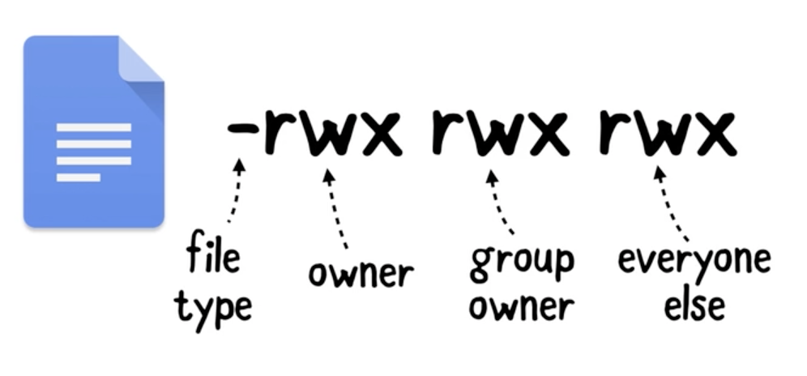

# Command-Line Basics

Notes from Raywenderlich 'Command-line basics' video course

# Beginning Command-Line

## Man Pages

Man is your wellspring of knowledge when it comes to learning about new commands. Make sure to get well-acquianted with it before moving on to more complex challenges.

```css
$:/ man man

note: press q to quit from man
```

## Navigation

`pwd` shows the path of my current directory

`ls` lists directory contents

`-a` includes directories begin with (.) (hidden files)

`-l` long - more explicit view

`cd` change directory

`clear` clear my screen

## Creation and Distruction

`touch` creates a file

`touch mystuff.txt touch selva/mystuff.txt`

`mkdir` Make directory

`mkdir selva_Stuff`

`open` open current directory in Finder

`open .`

`cp` copy file

`cp the_stuff.txt other_stuff.txt`

`rm` remove file

`rm other_stuff.txt`

`rm -r` remove files along with folder

`rm -r selva_stuff`

`ln` to create a symbolic link

`ln -s Koala.txt StrongestAnimal.txt`

We can chain the commands by using `&&`

`cd /Birds && touch Eagle.txt`

this creates Eagle.txt file under Birds folder

<aside>
💡 TIP - To goto a particular folder path, just drag the folder into Terminal, the path will be pasted. Then you can [OPTION] + Click at the front of the line to move the cursor there.

</aside>

## Find

To find the _'user.c'_ file in the current directory heirarchy

`find . -name user.c`

`find . -name *.c`

to find empty files

`find . -empty`

To edit the file use vim editor

`vim user.c`

## Searching Inside Files

To view the first chunk of the file

`head workers.csv`

To find 'what' word in a file

`grep "what" conversation.txt`

Grep is case-sensitive. to ignore add `-i` attribute

`grep "carlos" workers.csv -i`

We may pass another command's result to grep command

`cat workers.csv | grep "Carlos"`

Regular expressions with grep: `-E` Expression `-o` omit

`cat workers.csv | grep -Eo ',[0-9]+.[0-9]+,'`

### AWK

Extract csv data based on specific pattern.

`awk -F "," '{ print $3, $4 }' workers.csv`

To sort the workers data and get the top five employees salaries

`awk -F "," '{ print $3, $4 }' workers.csv | sort -k 3 -n -r -u | head -5 > top5.txt`

`-k 3` means we are sorting by 3rd column/key,

`-n` denotes the numeric sorting

`-r` to reverse the order. so that the high salries listed in the top

`-u` for unique results

`head -5` to dispaly top 5 records

`> top5.txt` the results will be included in newly created top5.txt file.

---

# Intermediate Command Line

OS has the kernal - Shell interacts with the kernal

Bash - Bourne-again Shell

Shell types

- Interactive shell Vs Non-interactive shell
- Login Vs Non-Login

When you start a shell there will be one or more startup files that get run and setup base environment.

> When we start Terminal in MacOS, a file called **.bash_profile** will be run to setup the bash environment.

To switch between shells, run one of the command and restart Terminal

`chsh -s /bin/zsh`

`chsh -s /bin/bash`

> **Oh My Zsh** is a community plugin for zsh enhances the command shell.

## Customizing ZSH

With the release macOS Catalina, the default shell is now zsh. Thankfully, it can run the same bash commands.

To edit the zsh configuration file, type: `vim .zshrc`

Add the alias commands at the end of the file as shown in the episode.

To reload the shell changes, type the following: `source .zshrc`

To update the prompt, type the following in .zshrc: `PROMPT=$'\n'"%d %n@%m "$'\n'"> "` Save and exit. Make sure to reload the changes by typing: `source .zshrc`

## Diff

To find difference between two files

`diff -p a.txt b.txt`

To create a patch file out of these differences

`diff -p a.txt b.txt > a.patch`

and this patch file can be applied on the other end with below command

`patch < a.patch`

To undo the patch

`patch < a.patch --reverse`
`patch -R < a.patch`

## File System

<aside>
💡 Everything is file in unix system.. even the directories.. 
If you are writing something to the console, you are actually writing into a file called 'STDOUT'
Even Printers, Networking Sockets are all files

</aside>

**File** - contains data and metadata(inode - tells where to find data)


hard links point to the original file. even there address will be same

## File Permissions



r - read

w - write

x - execution

To change permission we an use `chmod` command

`chmod 600 hi.txt`

this will set the file permission as `-rw-------`

`chmod 777 hi.txt`

this will set the file permission as `-rwxrwxrwx`

To change the owner of the file use `chown` command

`chown root hi.txt`

## Bash Scripting

Sample bash scripting:


### Loops


### Functions


## Automating Your Job


**Output:**


