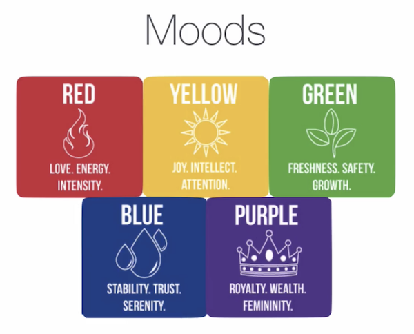
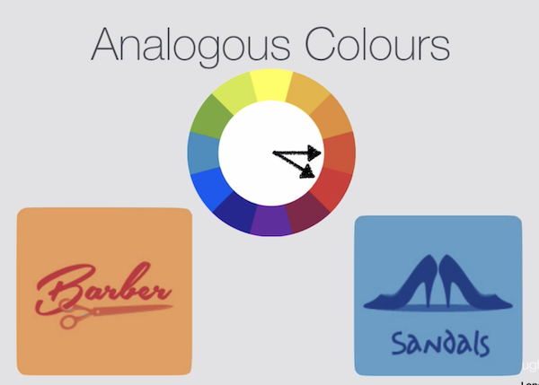
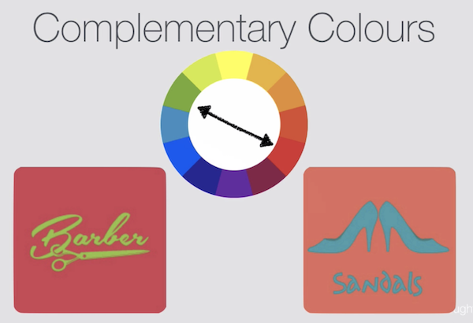
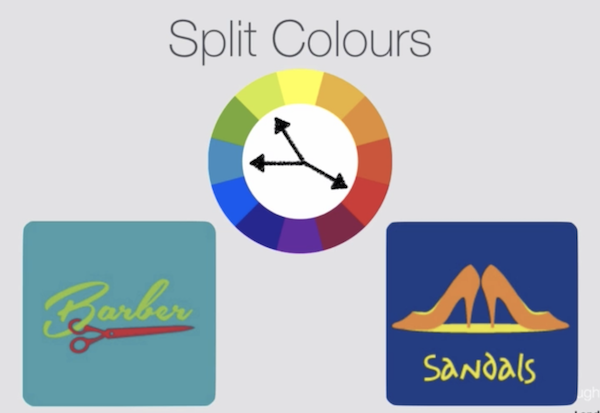
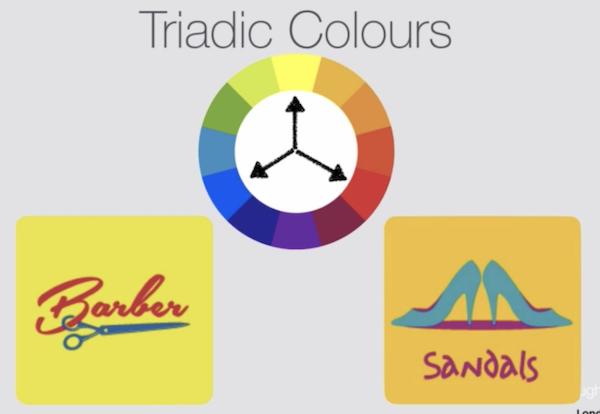
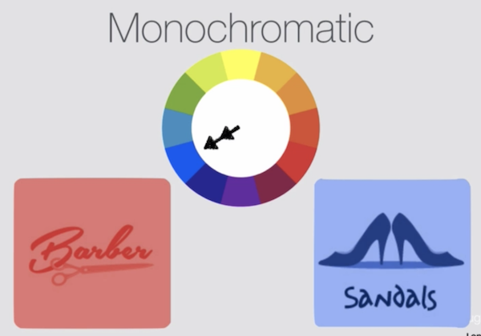

# Design Principles

### Color Theory

### Color Wheel

## Tools for designing with colors

- [https://www.colorhunt.co/](https://www.colorhunt.co/)
- [https://flatuicolors.com/](https://flatuicolors.com/)
- [https://www.materialpalette.com/](https://www.materialpalette.com/)
- [https://www.colorzilla.com/](https://www.colorzilla.com/)

### Further articles on Colors

[https://uxplanet.org/create-emotion-with-color-in-ux-design-446a3766b085#.833er7ned](https://uxplanet.org/create-emotion-with-color-in-ux-design-446a3766b085#.833er7ned)

**Books:**

- [https://www.amazon.in/Color-Course-Mastering-Mixing-Colors/dp/1585422193](https://www.amazon.in/Color-Course-Mastering-Mixing-Colors/dp/1585422193)
- [https://www.amazon.in/Interaction-Color-Anniversary-Josef-Albers/dp/0300179359](https://www.amazon.in/Interaction-Color-Anniversary-Josef-Albers/dp/0300179359)
