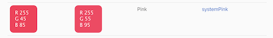
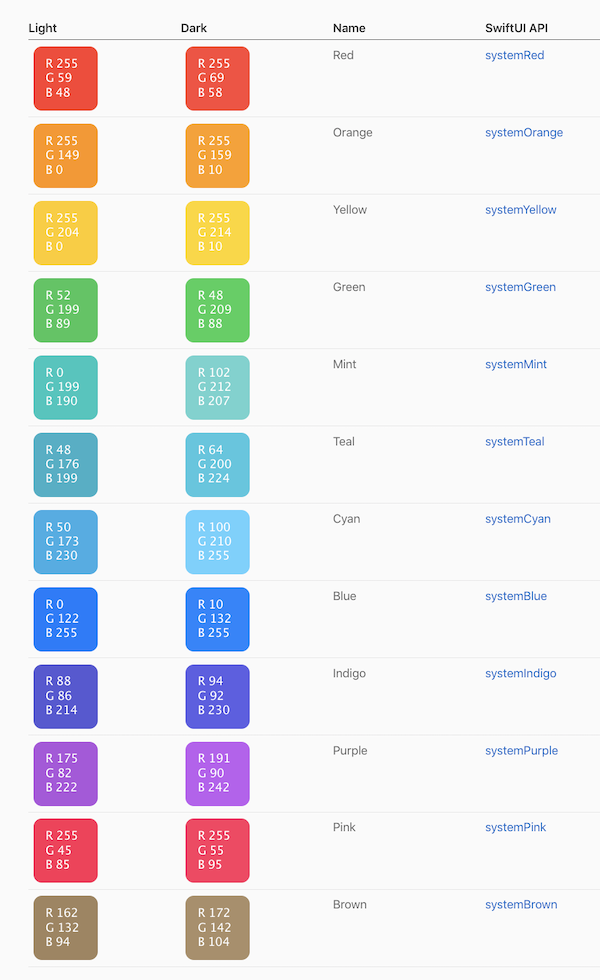

# Colors in iOS

Recently I have had a situation where my app looked differently on Simulator and in real iPhone. I have been using the system colors for the buttons. But the simulator one was looking good, where as iPhone looked differently that the colors are dull and darker.

I know for sure it must be some kind of settings issue.. Then I searched online and found the reason in Apple's Human interface guidelines.

It seems the color will automatically change on real devices based on `accessibility` settings. In my iPhone I had enabled 'Increase contrast' and 'Increase brightness' in the settings. When I disable that settings, the colors are back to the system default.

Check this picture for comparison between default and accessibility for both light & dark schemes.

### Default Colors

### Accessibility Colors

---

Here are full list of system colors. You can find more colors in [Apple's Human Interface Guidelines](https://developer.apple.com/design/human-interface-guidelines/ios/visual-design/color/).

