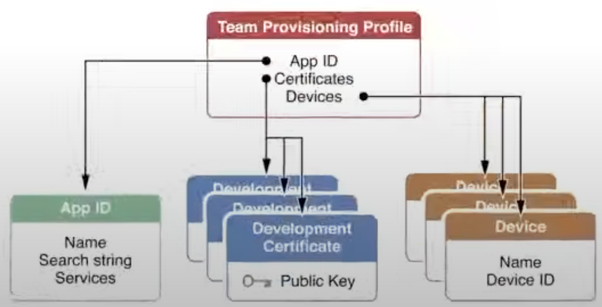

# Provisioning Profile

Apple - Provisioning profile, Certificates - Code signing

### Why?

- Code signing

After a code/app is signed then it can not be modified. This gives the security on the content reliability.

The way the code signing is done in Apple is with provisioning profile and certificates

### Provisioning Profile

Unlike Android, apps cannot directly run on any device. It has to be signed by Apple first

- Provisioning profile acts as a link between device and developer account
- it decides that app can run on what all devices and what all services can be accessed by the app
- Before the IPA is made, the profiles are downloaded from the developer account (or picked from the machine) embeded in the bundle and then the bundle is code-signed using certificates.

**What does a profile contains:**

- Development certificates
- Unique device identifiers (list of device that the app can run on)
- App ID(An App ID is a two part string used to identify one or more apps from a single development team)

### How does an app install from Xcode

- The developer certificate mentioned in your provisioning profile is checked against the certificates saved in your Mac’s keychain
- This certificate is used to sign the code.
- The device on which you are running, it’s UUID is checked against the IDs mentioned in the provisioning profile.
- Bundle Identifier of the app is checked against the App ID in the provisioning profile.
- Entitlements required by your app are verified against the associated ones with your App ID.

If all goes well, the app is installed in the device.

### Types of Provisioning Profile

- Development
  - It will be used on daily basis.. and it has the local devices info
  - Cant use this to distribute app
- Ad Hoc
  - Used later in the development process
  - Used to distribute your app to a small or medium size group of testers that are not included in the iOS developer program for your organisation.
  - App with ad-hoc profile will be almost identical to the version you submit to the App Store
- Enterprise
  - Used on later development process
- Distribution
  - This would nt have any device identifiers since this will be used to distribute on App Store
  - If it is used then the app can be installed on any device thus Apple code signs it.

### How code signing works

- Signing the app allows iOS to identify who signed the app and to verify that your app hasn’t been modified since you signed it.
- The signing Identity consists of a public-private key pair that Apple created for you.
- Assymetric Cryptography

### Certificate Signing Request

- A CSR or Certificate Signing request is a block of ecoded text that is given to a Certificate Authority when applying for a certificate
- Keychain Application will create a private key(private key will be stored in the keychain) and a certSigningRequest file which you’ll then upload to Apple.
- Apple will proof the request and issue a certificate for you.
- The Certificate will be pushed into the Keychain and paired with a private key to form the Code Signing Identity.
- Finally, at the time of app installation, the private key used to sign the app matches the public key in the certificate. If it fails, app is not installed.
