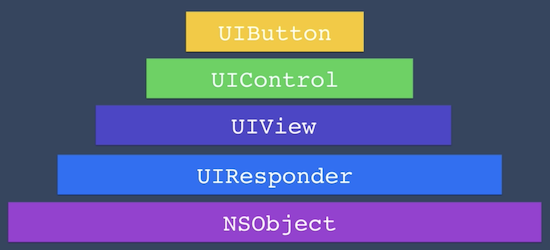

# UIKit

The view-controller life-cycle events are:

- init
- loadView
- viewDidLoad
- viewWillAppear
- viewWillLayoutSubviews
- viewDidLayoutSubviews
- viewDidAppear
- didReceiveMemoryWarning
- viewWillDisappear
- viewDidDisappear
- deinit

## UIButton View Hierarchy

