# XCode Tooling & Debudding

### Assistence

The assistence tab helps in viewing associated stuffs for the class file selected. Like related protocals, extentions, counterparts, test file etc

### Build Settings

1 Project → multiple targets, multiple configurations

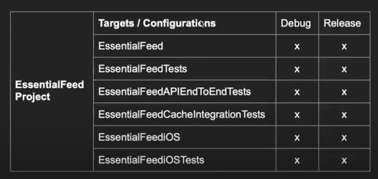

Build configuration = set of build settings used to build a target’s product in a particular way

### Configurations

The default set of configurations are `Debug, Release`

We can add additional configurations like adhoc, staging etc.

### iOS Code Signing

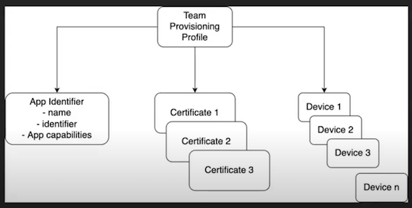

**What is a build setting?**

A property you can apply to your Xcode targets to configure aspects of how they are built.

Managing build settings:

- Via Xcode Build Settings Editor
- Via Configuration Settings Files (.xcconfig)

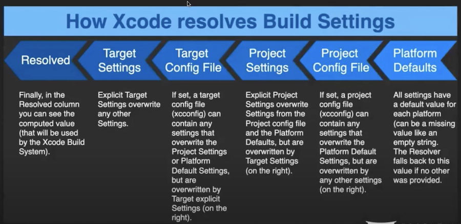

### Sample settings with above levels:

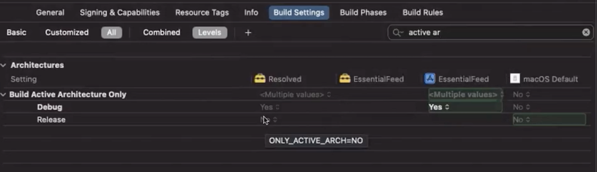

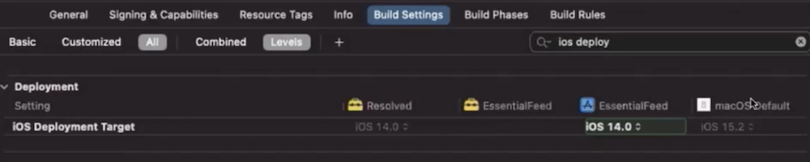

### Xcodeproj structure

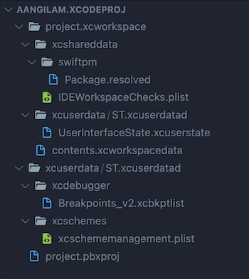

### Xcode support @ apple developer

[https://developer.apple.com/support/xcode](https://developer.apple.com/support/xcode)

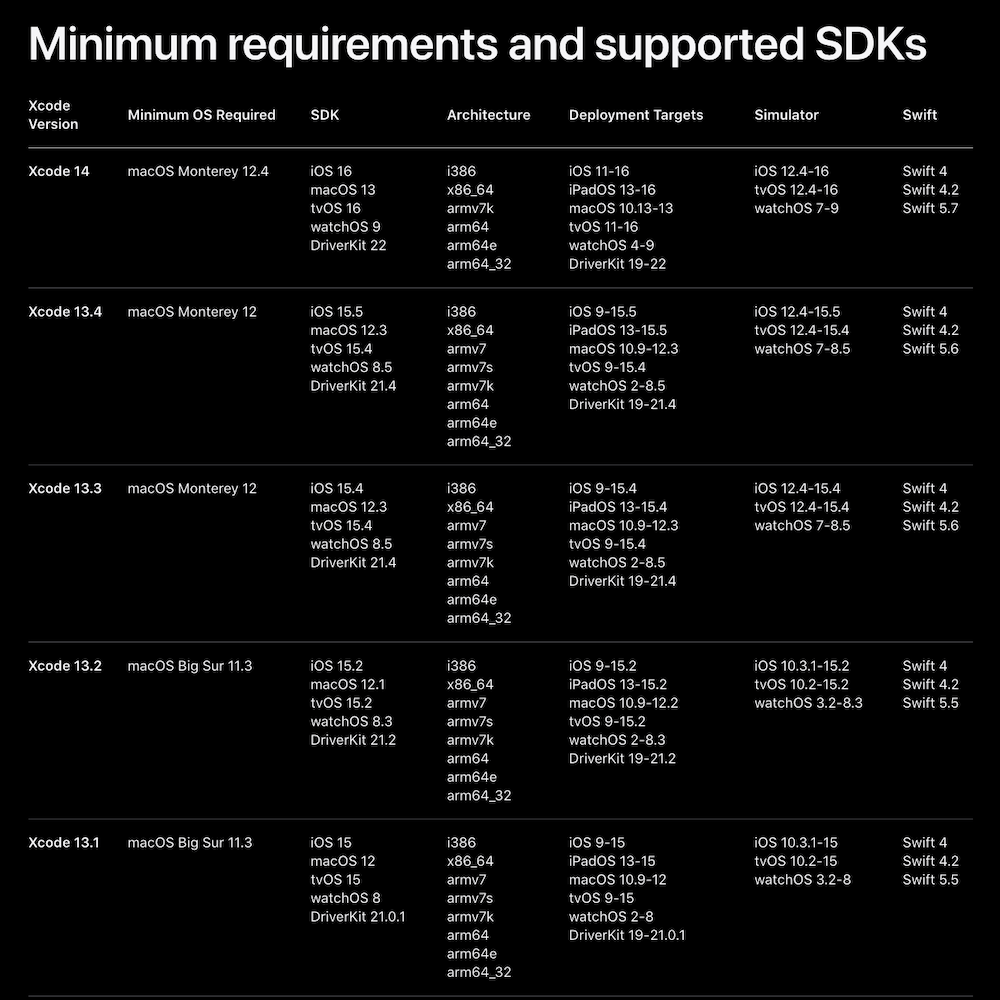

### Shortcuts

CMD + SHIFT + O - To open ‘Open Quickly’ search window.

---

# XCode debugging

### Debugging the stack trace

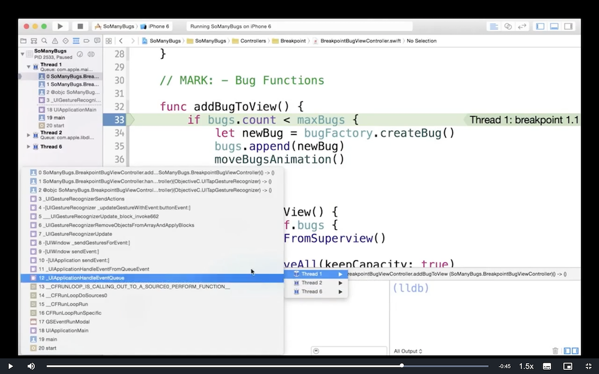

Viewing the thread this way showcases all the stack trace path.. (OR) click on the first bottom icon in the navigator pane.

### LLDB Debugger

LLDB - is a Low Level Debugger. Xcode has this command line tool to manipulate the debugging process.

Commands:

- fr v (OR) frame variable
- help
- frame help
- expr println(bugs)
- expr self.bugs.removeAll()
- po bugs
- po self
- expr unsafeBitCast(0x7fb08e300360, UIImageView.self)
  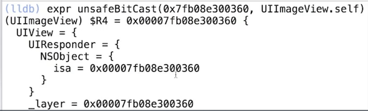
- expr let $bug1 = unsafeBitCast(0x7fb08e300360, UIImageView.self)
expr println($bug1)
  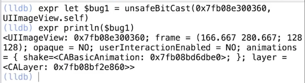
- expr $bug1.frame = CGRect(x: 0, y: 0, width: 64, height: 64)
expr println($bug1)
  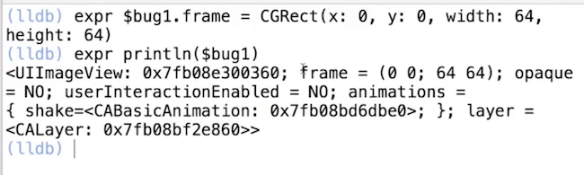
- breakpoint set —file BugFactory.swift —line 26
- breakpoint set —selector viewDidLoad
  - This sets the breakpoint in all views` viewDidLoad method.. pretty useful
- breakpoint disable 2
- breakpoint list
- thread backtrace all

### Breakpoint Pane:

Here we can configure like only pass after the 10th bug or so..

- Goto breakpoints pane and right-click on the breakpoint to see various options

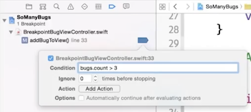

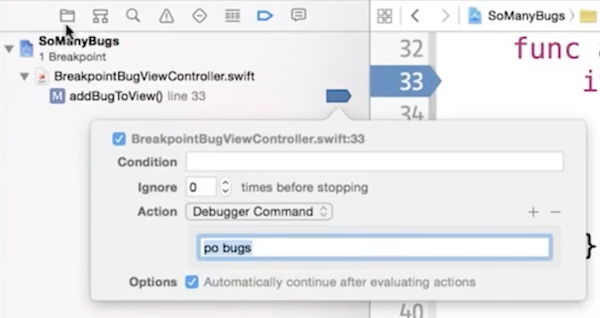

- Similarly there are many other options. For ex: ‘Action’ has other options to add sound when there is a bug or trigger another shell script when there is a bug.

**Resources:**

- [LLDB Quick Start Guide from Apple](https://developer.apple.com/library/archive/documentation/IDEs/Conceptual/gdb_to_lldb_transition_guide/document/lldb-command-examples.html#//apple_ref/doc/uid/TP40012917-CH3-SW1)
- More commands here - [https://lldb.llvm.org/use/tutorial.html](https://lldb.llvm.org/use/tutorial.html)
